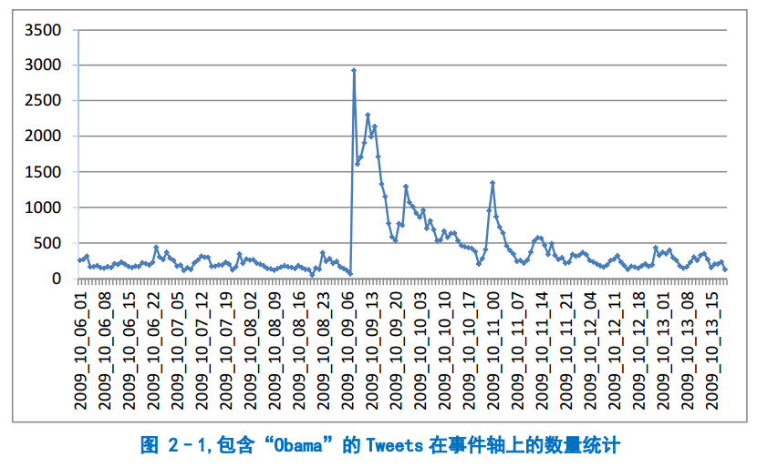

burst 事件检测
====================
.. sectionauthor:: Superjom <yanchunwei@outlook.com>

|today|

之前基于本部的 **burst事件平台** 做了一个文摘的demo http://infomall.cn/summary 。
折腾了一阵时间，各种框架和程序混在一起，做完了反而原理比较模糊了。

做个总结，就当文档了。

一些定义
---------
事件 (Event)
*************
    
查了下百度百科和wiki百科，百度的解释是发生过的历史和现代 **事件** 。 简化一下，就是“事件是事件”，呵呵。

意淫一下吧，事件是一类相关事情或大或小的集合，比如十八大召开是一个大点的事件；
十八大的某一个课题讨论也可以作为是一个小一点的事件；事件的粒度客观存在。

Burst
******

指一个词或词组在一段时间内的使用频度明显高于正常水平的现象，
如图 `burst-obama-tweet-statistic`_ ，
看到图中 **Obmma** 在 twitter 上的出现频率在2009年10月9日突然增高，就是有了一个burst，
常人的第一反应都是，Obmma 在这一天肯定出事了。

不管是微博，还是新闻。 当某件够轰动的事情发生之后，总会有很多报道。
那么一件事情如何能够吸引我们的注意力呢？ 就是曝光率。

比如某人某天百无聊奈地打开凤凰网， 看到 **南海981** 这个事情，可能就是简单看个标题就略过了。 

但是这个事情在qq，微信，微博上不断转载时，正常人一定会去看看这是个什么事情。
因为本能认为，肯定是什么事情发生了。 *（媒体创造了事件？）*

曝光度能够被人识别，也能够被算法检测。

Kleinberg 的 Burst 挖掘算法 
-----------------------------------
Kleinberg [kleinberg-burst]_ 有提出一个离散数据的burst检测算法。

由于是 burst词 的检测，每个文档表示为词的集合，
每个时间粒度都统计出整体数据集的词及词频，最终得到一个<词及词频，时间>的集合

.. math::

    <r_1, d_1>, <r_2, d_2> , \cdots, <r_n, d_n>

其中，:math:`r_t` 为在时间 :math:`t` 时与词 :math:`W` 相关的文档数目， 
:math:`d_t` 是在这一时间，所有文档的总个数，
自然 :math:`d_t - r_t` 就是时间 :math:`t` 下与 :math:`W` 无关的文档数。

Kleinberg 将 *是否为burst* 作为一个二元状态， **一个词** 在 **整个时间段** 里的burst的burst状态是一个 0,1序列。
算法目标产物就是得到这个序列。

将两种状态下，生成词 :math:`W` 的概率记作： :math:`P_0, P_1` 。

给定 burst 状态 :math:`k \in \{0,1\}` ， 时间 :math:`t` 上的统计值 :math:`<r_t, d_t>` ，
采用二元分布来刻画生成概率可以得到：

.. math::
    :label: eq-burst-genrative

    Prob_G(k, r_t, d_t) = 
        \begin{pmatrix}
            d_t \\
            r_t
        \end{pmatrix}
        P_k^{rt} (1- P_k)^{d_t - r_t}

将概率用 :math:`-\log` 的形式转化为代价函数:

.. math::
    
    Cost_G(k, r_t, d_t) = - \ln Prob_G(k, r_t, d_t)

公式 :eq:`eq-burst-genrative` 定义了某个时间点，一个词在某个状态的生成概率。
除此之外， burst状态在序列之间也是有关联的，比如超女时期，关于*李宇春*的事件不是短暂一瞬间，而是维持了相当长一段时间。 
那段时间 *李宇春* 开始走红，关于她的话题也倾向于构成事件。

体现在算法刻画上， Kleinberg 还定义了burst状态间的转移概率：

.. math::
    
    Cost_T(k_t, k_{t+1}) = \max (0, \gamma_{k_{t+1, t-1}}) 

可以看到，只有从状态0 转化到状态1 才是有损失了，具体的代价值为 
:math:`\gamma_{k_{t+1, t-1}}` 。
这样倾向于将小的burst词时间段连接起来形成大的burst序列。
同时提高变成 burst 词的门槛。

至此，模型的参数 :math:`\theta` 主要包括

.. math::

    \theta = \{ P_0, P_1, \gamma \}

三个参数都可以人为定义， Kleinberg 的做法是将 :math:`\gamma` 人为定义，
而 :math:`P_0` 和 :math:`P_1` 采用如下方式求出:

.. math::

    P_0 = \frac{\sum_{i=1}^n r_i }
        {\sum_{i=1}^n d_i}

    P_1 = \beta \times P_0, \beta > 1

其中， :math:`\beta` 人工定义，整体表示，:math:`P_0` 是整体数据集中，
与 :math:`W` 有关的文档比例（相当于基准概率）， 
而 :math:`P_1` 比 :math:`P_0` 更高，代表如果 :math:`W` 在burst阶段，
更容易产生相关文档。

根据 Cost 函数，利用动态规划就可以算出词 :math:`W` 在整个时间段内的 burst 状态序列。

在某个词确定为burst词时，Kleinberg 将 0状态 和1状态 Cost之差作为词 :math:`W` 的热度：

.. math::

    Cost_G(0, r_t, d_t) - Cost_G(1, r_t, d_t)

实现描述
-----------
Infomall(http://infomall.cn) 中存储了大量中文网页，
我们取得了02年到13年近十年的去噪后的网页正文数据，总共 7M 个网页。 

滑动窗口
*********

对这么长时间跨度的数据进行挖掘，无法计算全局的 Kleinberg 状态序列。
实现中，采用滑动窗口的方式，将序列的计算局限在一定时间跨度的窗口内的数据集上。

具体实现是用的3个月作为一个挖掘窗口，上面的 :math:`P_0,P_1` 均在此局部数据上计算得到。

在滑动窗口重叠或者连接的地方，比如::

    |-------------|
        |-------------|
            |-------------|
                |-------------|
                    *

其中*标记处在每个窗口内都会计算出来一个burst状态，也就是总共有4个burst状态，
直接用投票方式得出最终状态。

事件分割
*********
burst 检测以词为单位，如果在一段时间内，词 :math:`W` 处于burst状态。
那么认为，与 :math:`W` 有关的一系列文档也在一定程度上表现出了成为事件的程度属性。

将包含 :math:`\alpha` 个burst词的文档作为激活文档（其被某个事件包含）。

从burst词到事件，需要将相关文档进行聚类，得到不同的事件。

聚类过程可以认为是普通的文本聚类。
但由于每个窗口内的数据也较大，采用层次聚类，只考虑每个文档包含的burst词集合。

话题挖掘
**********
得到事件之后，在事件包含的文档集内分解话题，直接用LDA就可以了。 
其中话题个数需要人工定义。

References
------------
.. [burst-shubohan]  基于 BURST 的社交网络事件挖掘,树柏涵,2012,硕士论文
.. [kleinberg-burst]  J. Kleinberg. Bursty and hierarchical structure in streams, Data Mining and Knowledge Discovery 2003

