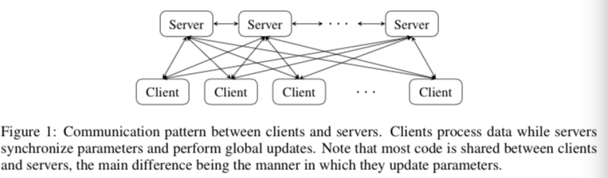
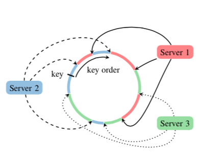

Parameter Server for Distributed Machine Learning
=====================================================
.. sectionauthor:: Superjom <yanchunwei {AT} outlook.com>

*2014-02-18*

.. note::

    本篇博文来自百度李沐的一篇同题论文。
    本来是要做笔记，写完发现只是大概翻译了一下。
    目前自己也在写一个参数服务器，也许很多细节需要探索和借鉴，所有后续会有多一些的内容。

大体结构
---------
参数服务器框架整体分为client和server两大部分，两部分均为分布式结构。 

其中，数据和计算均拆分到client端并行。
而server端负责参数的分布式存储的共享和一致性维护。

特点： 稳定、容错

易用
^^^^^^^^^
全局参数被表现为向量和矩阵。
这个对向量/矩阵的代数运算要比传统的key/value格式要高效很多。

高效
^^^^^^^^^
节点间的消息交流是异步的，参数协同操作也不会阻断计算操作。

框架的使用者能够根据自己的场景和集群环境来权衡算法的拟合效果和系统的效率。

弹性可扩展
^^^^^^^^^^^^^^
无需重启已运行的框架便可以添加新的节点。

框架包括一个分布式的hash表来支持新节点的动态添加。

容错性
^^^^^^^^^^^^^^^^^^^
在大规模的集群里，节点故障是难免的。

比如，如果单个节点平均三年出一次故障，
那么一千个节点规模的集群平均一天就会出一次故障。
在频繁调度的过程中更容易出现故障。

server端参数的冗余存储使得节点故障后可以快速恢复。
此外，由于client端节点像MapReduce框架中的worker一样互相独立，出现故障后也可以被快速重启。

架构
-----
参考上图，参数服务器中包含两种节点： server节点和client节点。

其中，server端节点中，每个节点维护共享参数（量巨大）的一部分（分布式存储）。
节点本地的参数默认并没有同步，需要通过节点间的通信来维持。

client节点负责计算； server节点负责记录和全局的协同。
每个client会存储训练数据特定的一块，在此数据上执行迭代计算，并只跟server节点通信，更新和重新获取这一块训练数据上涉及到的参数。

client节点可以被添加或删除，其中需要将特定节点对应的那部分训练数据传输给新的节点（机器），同事查询对应的参数。

参数服务器可以同时支持多个独立算法的参数向量。
这个在多个算法间需要传递或者共享参数的时候会用到。

应用实例
^^^^^^^^^^^^^

Risk minimization by distributed subgradient iterations
++++++++++++++++++++++++++++++++++++++++++++++++++++++++++
目标是解决如下形式的优化问题：

.. math::

    F(w) = \sum_{i=1}^n l(x_i, y_i, w) + \Omega(w)

其中， 

* :math:`l(x_i, y_i, w)` 是损失函数
* :math:`x_i` 是数据
* :math:`y_i` 是标注/目标
* :math:`w` 是模型参数

具体计算需要重复计算 :math:`F(w)` 的梯度。
将这个计算过程部署到参数服务器上，细节如下：

1. 全局共享的参数 :math:`w` 在被维护在server节点上
2. client节点并行执行，每个节点中存储训练数据的一份，不断迭代计算，以及向server节点发送更新和获取涉及到的参数
3. 在计算中，server端不断汇总来自不同client的更新，向访问参数的client回复更新后的参数

Risk minimization by parameter synchronization
+++++++++++++++++++++++++++++++++++++++++++++++++
client端存储一块本地的参数，并且通过参数服务器来实现参数协同。

Distributed Gibbs Sampler
+++++++++++++++++++++++++++++++++++++++++++++++++
用Gibbs计算LDA时，涉及到三个矩阵：

* document-word 矩阵
* document-topic 矩阵
* word-topic 矩阵

其中，如果按照document将训练数据拆分给client节点，
那么前两个矩阵的计算（统计）都可以限制在本地。

第三个word-topic的全局矩阵被维护在server节点端，client在计算过程中更新此矩阵。

Deep Learning
+++++++++++++++++++++++++++++++++++++++++++++++++
Deep Learing本质上就是执行几类非线性的函数。

其中涉及到互相依赖的变量，以及对大数据的分布式并行处理。
有专门的算法来实现这两者的分布式拆分。

接口
-----

Key-Value 向量
^^^^^^^^^^^^^^^^^
与已有的方法不同的是，我们嘉定key是有序且稠密的。

这个假定有如下优势：

* 可以使用向量及向量的操作
* 可以成块地发送大量的数据，而非单独的key-value对
* 简化内存管理，以及网络传输
* 不需要单独的索引表（稀疏的keys需要）

注意，这种方法其实是参数服务器提供模式的子集。 

应用可以将这些参数当做向量/矩阵，或者key-value对。
计算中，可以通过key来访问或者修改具体的value，比如LDA中的word_id, topic_id。
client和server都可以在参数向量上执行线性代数的计算，这部分有很多现成的优化方法，比如BLAS等。

PUSH 和 PULL
^^^^^^^^^^^^^^
节点之间的数据通信通过两个操作： push 和 pull.
前者将本地数据的修改发送给其他的节点，后者则将参数的远程更新载入到本地。

为了减少网络传输的时间，参数服务器只会传输需要的参数节点。

比如，每个server的节点只维护共享参数的一部分。
当一个client进行PUSH操作，框架会找出所有有更新的本地数据，
然后将这些数据(本地的更新信息)发送给所有的涉及到的server节点。

而在PULL操作中，每个client节点往往只需要全局共享参数的一个子集（局部训练数据所涉及到的key是有限的）
因此，server节点也只会回复给client节点，client需要的那部分数据。

User-Defined Functions on the Server
^^^^^^^^^^^^^^^^^^^^^^^^^^^^^^^^^^^^^^^^
在server节点上，也可以运行用户定义的函数。
这样做的原因是，服务器端对不同client传送过来的update的操作，往往也是需要定义的。 
比如Adagrad，在合并grad的时候，操作有点复杂需要自己定义，类似这样的算法均需要server端特定的操作。 
允许用户定义server端的函数，无疑可以增大灵活性。

Toward Scale and Reliability
-------------------------------

Consistency Model
^^^^^^^^^^^^^^^^^^^^^^
异步通信能够提高系统对包括CPU、磁盘及网络带宽等资源的利用率。
但同时也可能降低优化算法的收敛速度。

算法的收敛速度和系统的效率之间的权衡需要参考许多因素，比如：

* 算法对数据不一致的敏感程度
* 训练数据中的特征相关性
* 硬件各方面的性能

为了实现重复的灵活性，参数服务器提供了几种模式，用户可以基于自己的应用场景进行选择。

* **Best Effort** 参数服务器持续运行，即使有资源不可用的情况。 这个只在算法对延迟充分鲁棒的情况。

* **Maximal Delayed Time.** 当设置了PUSH操作的一个最大延迟时间 :math:`T` ，那么在 :math:`T` 时间后提交的PUSH操作，只有在之前所有的PUSH操作均执行完毕才会执行。 当然，如果 :math:`T=+\infty` ，那么就变成了 **Best Effort** 模式，也就是对延迟时间不管不顾。

* **User-defined Filters** 参数服务器支持用户自定义的过滤器。 一个例子是 *significantly modified* filter，就是只push显著变化的参数：

.. math::

    \left| w_k - w_k^{(synced)} \right| > \Delta

一种选择就是在初期选择较大的 :math:`\Delta` ，之后逐步减小 :math:`\Delta` .

Elastic Scalability and Fault Tolerance
^^^^^^^^^^^^^^^^^^^^^^^^^^^^^^^^^^^^^^^^^
共享数据采用key-value对的格式。

包括key-value对和server节点均会被插入到一个哈希环中。

其中，每个节点会负责维护的参数范围是，其在哈希环中的起点到下个节点的起点。

在上面的图中，每个server节点会负责同一颜色的参数部分。

框架中使用了DHT(分布式哈希表)，并且将key到节点的映射信息存储在Zookeeper中的Paxos算法中。

为了负载均衡，每个物理节点会在哈希环中插入 :math:`\log p` 个虚拟节点。

每个参数段会在哈希环中 :math:`k` 个逆时针的相邻的server节点中存储副本以实现容错。
如果 :math:`k=1` ，则这部分参数会在逆时针相邻的一个server节点上保存副本。
然后，当一个节点失效时，它的服务会被其最近的server节点提供。
当恢复一个节点时，只需要在失效节点的位置插入一个新的节点，然后从其相邻的server节点将之前的那部分数据恢复过来。

.. note::

    论文后面的理论分析会专门在新一篇博客里添加
    很多细节不是特别清楚，估计需要看源码了。

    项目具体信息可以参照 http://www.parameterserver.org/

References
-----------

Li M, Zhou L, Yang Z, et al. Parameter server for distributed machine learning[C]//Big Learning NIPS Workshop. 2013.

.. raw:: html

    

.. raw:: html

    <!-- 多说评论框 start -->
    

    <!-- 多说评论框 end -->
    <!-- 多说公共JS代码 start (一个网页只需插入一次) -->
    
    <!-- 多说公共JS代码 end -->

