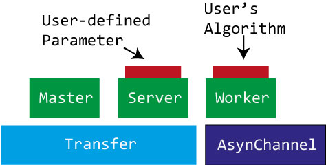
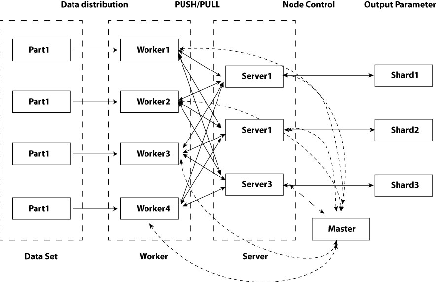

.. doc documentation master file, created by
   sphinx-quickstart on Sun May  3 13:12:32 2015.
   You can adapt this file completely to your liking, but it should at least
   contain the root `toctree` directive.

SwiftSnails 参数服务器
==========================================
项目地址：https://github.com/Superjom/SwiftSnails

SwiftSnails 是一个小型的分布式参数服务器。
适用于一些参数比较固定的模型的分布式计算，比如Logistic Regression，或者FM，神经网络这些模型。

提供参数的分布式存储，以及PUSH/PULL访问接口，用户可以在这些接口之上实现具体的逻辑，包括batch sgd或者minibatch sgd。

项目后续的发展方向是一些性能优化，和多一点的Demo。

欢迎有大神贡献代码，意见和建议。

任何一个项目都是为一个场景而服务，目前SwiftSnails实验的锅比较小，所以身量有限，如果应用的多的话，肯定会慢慢丰满起来。

工作原理
---------

按层次划分
***********

    系统层次

图中主要分为三个层次，最底层为环境封装层，包含两方面的封装

1.  Transfer模块：分布式的消息传递框架，抽象了集群中的通信拓扑，对上层提供节点间的简单消息传递接口
2.  AsynChannel模块：包含几种线程池的实现，封装了单机的多线程资源，系统总体上依赖此框架实现多线程并行

第二层为功能节点层，包含了三种节点的实现框架

1.  Master节点：类似于MapReduce框架中的中央控制节点，是整个集群任务的管理监控节点，负责系统的启动和结束。一个集群任务只有一个Master节点。
2.  Server节点：参数服务器节点，正常一个集群任务中会包含多个Server节点来分布存储全局参数。
3.  Worker节点：具体承担计算任务的节点，负责对训练数据进行学习，并通过访问Server节点不断查询和更新全局参数。

三种节点对集群的硬件需求不同。
其中，Master节点需要负责整个分布式任务的起始和结束，不参与中间的计算过程，因此需要的资源相对较小。
每个Server节点需要存储模型的部分参数，这部分需要一定的内存，此外还需要接收Worker节点的参数查询和更新推送，这部分IO操作较多。
而Worker节点负责具体的计算，需要多线程实现高并发。本文用底层的AsynChannel来封装了各种形式的线程池及生产者-消费者模式来适应这些需求。

系统的第三层为用户自定义层，用户可以在这一层自行定义模型算法和参数的数据结构。其中用户的模型主要部署在Worker节点上，用户参数结构主要在Server节点上。这两个节点的设计，本项目使用了适配器模式来实现框架本身的灵活性。

按节点划分
***************

    系统结构

.. note:: 

    本项目并不包含数据分发，或集群控制等功能。
    类似的需求用户可以自己实现，SwiftSnails-Word2Vec项目中的tools是在实际使用的脚本，可以参考。

集群中包含三类节点：

* Master: 中央控制节点，控制任务的启动和结束
* Server: 参数服务器，负责分布式存储全局参数，并接受Worker的参数访问
* Worker: 计算节点，负责学习数据，并通过PULL和PUSH远程更新参数

Master节点
+++++++++++
Master节点是SwiftSnails参数服务器的中央控制节点，目前负责集群任务的起始和结束。其中起始阶段，Master会负责搜集整个集群各个节点的TCP地址，并将全局的路由表广播给任务中的每个节点。

在结束阶段，集群中每个Worker节点在结束了自己的计算任务后，会向Master节点报告自己的结束状态。Master会在所有的Worker结束任务后通知所有的Server节点输出自己存储的参数块到磁盘作为任务产出。之后，系统中所有节点结束执行。

Master节点是对用户应用透明的，用户在编写自己的模型时，不会接触到Master节点的修改或定制。

Server节点
+++++++++++++++
Server节点负责分布式存储参数的任务。多个Server节点合起来会构成一个分分布式参数服务器，向Worker提供参数的查询和更新服务，这两个服务提供的方式就是提供两个接口PULL和PUSH操作。

其中，Worker节点向参数服务器查询参数的操作就是PULL操作。而Worker节点向参数服务器上载参数更新的操作称为PUSH操作。

Worker节点
+++++++++++++
Worker节点是三种节点中离应用最近的节点，用户需要直接负责Worker节点中模型算法的编写。一个单机的算法要通过SwiftSnails迁移到分布式环境，原有算法需要少量修改（比如需要改成类似minibatch方式训练），并作为模块填充进Worker节点的框架中，整个算法就可以分布式执行了。 

SwiftSnails为Worker节点提供了PUSH/PULL两个操作（远程）全局参数的接口，此外包含一个Worker基类，包含集群初始化和结束任务的逻辑。中间算法计算的具体计算过程完全由用户定义。这样，可以以最大化地提供灵活性（比如可以自行实现完全异步的Downpour SGD[14]，或者必须同步的batch sgd[32]）。

Worker节点在实现中，充分使用了C++的模板(template)和面向对象等技术来实现适配器模式。用户只需要定义好计算的那部分模块便可。

.. note::

    SwiftSnails底层的消息传输是封装的ZeroMQ的功能，而不是MPI。
    这样的好处是底层足够清晰，为后续的冗余和容灾提供底层的支持（最初是这个想法）。
    弊端就是，让整个初始化和结束过程看起来有点原始（需要手动配置IP，搜集地址，手工kill集群任务）。

API
----

目录
********
作为框架，SwiftSnail包含一些接口，当然代码量也比较少，即使全部看完，也比较容易。

一些有用的目录如下：

* src : 项目源码
* src/core : 项目核心代码
* src/core/framework :框架模板（主要接口）
* src/core/utils: 框架的一些底层代码
* src/core/parameter: 有关参数的接口
* src/core/transfer: 消息传递的框架，用户基本用不到
* src/core/system: 参数服务器的内置逻辑，用户基本用不到
* src/apps: 一些demo的代码，目前有word2vec
* src/tools: 一些脚本工具，基本不能直接用，需要根据自己的环境修改
* src/unitest: 项目早期的一些单元测试

使用
******
将swiftsnails加入到INC搜索路径中。

后续步骤:

1. 引用头文件::

    #include "swiftsnails.h"

2. 准备参数数据结构

3. 准备参数操作方法：

    * 继承 PullAccessMethod
    * 继承 PushAccessMethod

4. 编写三类节点
    
    * Master节点: 继承 SwiftMaster
    * Server节点: 继承 SwiftServer
    * Worker节点: 用户的主要算法在此处编写
        * 原有的单机程序需要转化为类似minibatch的方式来训练
        * 单个minibatch起始和结束进行PUSH（发送更新)和PULL（发送查询请求)

框架配置
----------

SwiftSnails中需要三类节点的配置，此处基准配置在 config/ 目录中

common.conf::

    # 是否对传输消息进行压缩
    # 0 表示不压缩，数值越大，压缩比例越大
    zlib : 0~9 数值

master.conf::

    # master 节点侦听地址
    listen_addr: tcp://127.0.0.1:16831

    # master 守候进程数
    async_exec_num: 4

    # worker节点数 + server节点数（必须要配置）
    expected_node_num: 4

    # 初始化等待时长，超时后，master将不再接受节点登记，单位为秒
    master_time_out: 120

    # 参数分块数，便于参数拆分，可以设置为 server数目 * 3
    frag_num: 50

worker.conf::

    # worker守候地址，可以不配置，节点会自动获取本机ip及随机端口
    listen_addr:

    # 守候线程数目
    async_exec_num: 2

    # 初始化超时 最好和 master_time_out 设置相同时间
    init_timeout: 60

    # master的监听地址，需要和 master.conf中的listen_addr 相同
    master_addr: tcp://127.0.0.1:16831

    # 计算线程数目，最好设置为CPU核数
    async_channel_thread_num

    # 迭代次数 如果数据比较大，只需要1轮迭代
    num_iters: 1

server.conf::

    #类似配置参考 worker.conf

    # 单个server上的参数分块数（由于采用了读写锁，拆分多个shard后可以提升性能)
    # 可以设置多一点 30+ 300+ 都可以
    shard_num: 5

    # 执行过程中的参数备份的周期 
    # 备份的周期单位为PUSH的次数
    # 一轮迭代的PUSH次数可以通过 单个节点训练数据行数 / minibatch长度
    param_backup_period: 0
    param_backup_root: ./param_back/

    # 是否使用AdaGrad，0表示非, 1表示是
    adagrad: 1

性能和建议
-----------
我们实现了一个分布式的Word2Vec的应用作为demo，详细的数据可以参考 http://superjom.github.io/SwiftSnails-Word2Vec/

项目本质上实现了PUSH/PULL的API，如何使用PUSH/PULL接口，完全由用户的应用控制。

一些常规的建议如下：

* 分布式环境下一般使用key-value来拆分参数，要使用map来存储参数，最好使用无锁设计（集中写，集中读，不加读写锁），否则性能会非常差
* 控制minibatch的长度，minibatch直接影响PUSH/PULL操作的频率，每次网络传输的代价都比较高，但传输参数太大的话网络传输的耗时也会变得很长
* 规划好参数的数据结构，参数里面不要std::vector这类动态列表（会占用额外的内存和计算时间），尽可能简单
* 本地多线程，这是必须的

.. toctree::
   :maxdepth: 2

Indices and tables
==================

* :ref:`genindex`
* :ref:`modindex`
* :ref:`search`

