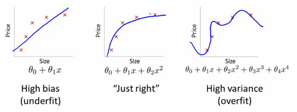
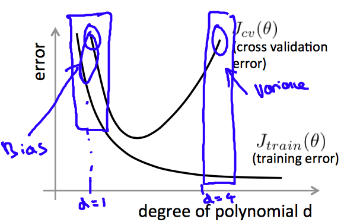
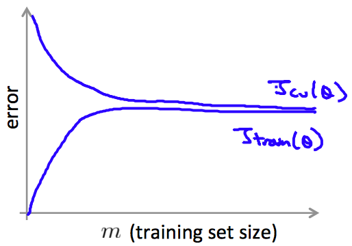
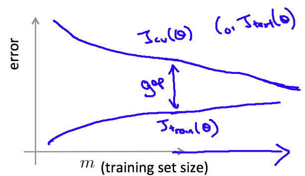

机器学习中的bias && variance && 选择下一步
==============================================
.. sectionauthor:: Superjom <yanchunwei {AT} outlook.com>

*2014-12-04*

Introduction
-----------------
在开展一个机器学习任务时，取得一批数据，选定模型，训练误差、测试误差。

我们总是尝试着去降低测试误差，在这条路上，一直有两条路：

1. 选定一个牛逼的模型
2. 特征工程，产生更加丰富的特征

如何权衡这两者的关系？ bias&&variance分析能够帮我们指定下一步计划。

比如，在high variance的情况下，应该减少特征，或者添加数据量。 而 high bias 的情况下，应该添加更多特征，反之千方百计添加数据量也不会有效果。

有这样的经验的话，相信减少一些做无用功吧。

bias/variance
---------------
机器学习模型产生的误差，可以认为三个来源

.. math::

    error = noise + bias + variance

数据固有的noise，就不是模型本事能够控制的了，本文重点聚焦后面的bias和variance.

下面是从quora上爬下来的两个定义:

Bias是由于算法能力有限，无法学习到训练数据中总体信息而产生错误的趋势(under-fitting)

Variance是算法采用高度复杂的模型来学习到了数据中随机的信息而产生错误的趋势(over-fitting)

Bias和Variance是fit程度的一个衡量，两者结合起来，可以用来描述under-fitting、over-fitting的趋势。

其中，Bias常用来描述，算法的平均精度随着输入数据的变化而变化的特性。 
而Variance用来描述算法对输入数据的敏感程度。

under-fitting/over-fitting
----------------------------
under-fitting和over-fitting都是应该避免的状态，但是模型极可能都在这两个状态中切换，只是控制的程度不同而已。

正常情况下，我们的理想目标都是得到这样一个模型：

1. 能够学习到训练数据中的规律
2. 对未知的数据同样有效

参照下图：

这是一个n-阶的linear-regression模型。

我们可以看到，当degree=1的情况是under-fit状态

1. 模型没能学习到数据的总体规律(high bias)
2. 此时，添加更多的同分布的新数据，效果也不会有太大变化(对数据不敏感，low variance)

另外一方面，当利用多项式(degree=20)来拟合时，会出现over-fit的情况：

1. 曲线完美拟合了训练数据(low bias)
2. 但在新数据上，这么复杂的曲线将会失效(新数据敏感,high variance)

一个合理的拟合模型，应该是能够很好地学习到训练数据中的规律(low bias)，并且对同分布的新数据也有很好的适应能力(low variance)。

不幸的是，世上没有免费的午餐。 想要在训练数据之外的数据集上也得到很好的效果，权衡(tread off)必不可少。

如何选定下一步
-----------------
一般开展一个ML任务的时候，我们手上都会准备一个初始数据集，准备了一批初始的特征集合，用了一个简单的模型跑出了第一个产出。

如果学出来的模型对未知数据（或者测试集）的误差很大呢，下一步路在何方？

* 设法增大训练集？
* 添加特征？
* 减少特征，特征筛选？
* 构造特征？
* 提高学习率？
* 减小学习率？

很多时候，我们只能看到效果差，然后尝试各个方向360度突击，劳命伤财。

下面是Andrew的ML课里介绍的类似场景的分析方法。

拆分数据集
+++++++++++++

首先，将数据集拆成三块:

* 训练集
* 验证集
* 测试集

比例，可以设为60%, 20%, 20%.

对应着这三个数据集，就有三个误差值：

* Train error
* Cross Validate error(CV error)
* Test error

其中，前两者配合起来，控制模型学习过程(主要的分析也在这个阶段)。 而测试集用于面向未知数据的最终模型预测效果的评定。

这三个误差配合起来，就可以用于ML下一步的选择。

学习曲线
++++++++++
上面说过，Train error, CV error用来控制训练过程。 

train error 和 CV error在模型迭代学习过程的状态是

可以看到，train error和CV error在刚开始都是下降的，但是后面过了CV error的最低点后，两者分歧就愈来愈大(模型陷入了over-fit的不归路)

具体的就是利用验证集上的误差最小时，停止模型迭代。 在这个停止的状态时，Train error和CV error就有了两个值(下面依旧称为 Train error 和 CV error)。

通过增大数据集的规模（Train set, Validate set同比例增加），这两个值理论上应该有如下图形：

可以看到，当数据量增加的情况下，理论上train error 和 CV error是会有一个持续的接近的趋势，这个在数据量无穷大的情况下会比较明显（忽略固有噪音误差）。

train error增加是因为对更多数据的拟合难度加大，更多的数据的加入也使得模型更加聚焦于更全局的规律而非随机噪音，因此variance会下降。

另一方面，CV error减少，是因为更多数据的加入，使得模型能够真正地学习到数据中的普遍规律，从而提升了CV阶段的效果。

将数据规模由小到大增加，来看模型精度与数据规模之间的关系：

这张图和上面一张图的区别就是，数据量被限定到一个有限的规模。

同样的，Train error 和 CV error也有趋近的趋势(这里的Train error 和 CV error都是模型停止迭代后计算出来的)。 

但是，在有限的数据量下，两者曲线的高度以及其中的间隔(gap)就可以表示一些信息了。 

间隔大小可以表示variance的程度(在train set上训练的模型，到CV set上效果比训练时越差，表明对数据越敏感，variance越大)

总体曲线代表的精度大小可以表示bias的程度(如果训练误差较大，说明模型未能学到全局数据的规律，高bias)

我们所向往的理想状态是，low bias && low variance，具体含义就是，模型对训练数据拟合的很好(low bias)，
而且对未知数据不敏感(low variance)。

表现在图像上，就是两条曲线充分接近了起来，而且最终接近的中间线代表的误差比较小。

分析和实施
++++++++++++++++
回到最初的问题，当发现在目前的数据集上，模型的效果不佳怎么办。 

那要做的就是画出其学习曲线出来，用上一节的方法分析一下。

1. high bias的话，说明模型太简单，或者特征太小，此时添加更多特征，或者用一个稍微复杂点的模型试试会比较好
2. high variance的话，说明模型把注意力聚焦到了数据中的noise上了。 此时要做的是添加更多数据(用普适规律击败noise)，或者模型化简加正则（约束下学习能力），或者特征筛选较少部分特征。

high/low bias 以及 high/low variance两两组合起来会有四种情况，需要对应分析。

References
-----------

How would you explain the bias-variance tradeoff to a five year old? 
https://www.quora.com/How-would-you-explain-the-bias-variance-tradeoff-to-a-five-year-old

Machine Learning Course by Andrew Ng on Coursera.com
https://d396qusza40orc.cloudfront.net/ml/docs/slides/Lecture10.pdf

.. raw:: html

    <!-- 多说评论框 start -->
    

    <!-- 多说评论框 end -->
    <!-- 多说公共JS代码 start (一个网页只需插入一次) -->
    
    <!-- 多说公共JS代码 end -->
