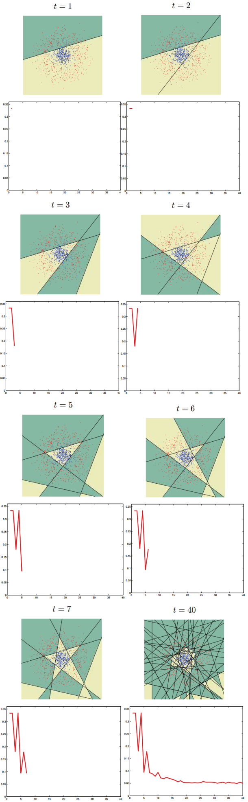

提升方法-AdaBoost
==================
.. sectionauthor:: Superjom <yanchunwei {AT} outlook.com>

|today|

Boosting 介绍
----------------
Boosting方法是一个框架，在分类问题中，通过学习多个分类器并进行组合来提高分类的性能。

基本的算法如下：

Given: :math:`(x_1, y_1), \cdots, (x_m, y_m)` 其中 :math:`x_i\in X` ， 
    :math:`y_i \in Y = \{-1, +1\}`

Initialize :math:`D_1(i) = 1/m` .

For :math:`t = 1, \cdots, T` :

    * Train base learner using distribution :math:`D_t` 
    * Get base classifier :math:`h_t: X \rightarrow \mathbb{R}` 
    * Choose :math:`\alpha_t \in \mathbb{R}` .
    * Update :

.. math::
    
    D_{t+1}(i) = \frac{D_t(i) \exp (-\alpha_t y_i h_t(x_i))}
                    {Z_t}

where :math:`Z_t` is a normalization factor

Output: the final classifer:

.. math::
    
    H(x) = sign \left( 
        \sum_{t=1}^T \alpha_t h_t (x)
        \right).
        
      
算法具体的意思看如下 Adaboost的介绍。

Adaboost
-------------

定义
********

给定一个二元分类的数据集：

.. math::
    :label: eq-trainset

    T = \{(x_1, y_1),
            (x_2, y_2), 
            \cdots, 
            (x_N, y_N)\}

其中， :math:`x_*` 是feature部分， :math:`y_*\in \{-1, +1\}` 是label。

Adaboost 会学习一系列的弱分类器 :math:`\{h_m(x) | m = \cdots\}` ， 
然后组合起来，构成最终的分类器 :math:`H(x)` 。

Adaboost 中涉及到两个方面的权重：

1. 数据的权重 :math:`w_i`
2. 弱分类器的权重 :math:`\alpha_i`

算法
*********
Input: 训练数据：:eq:`eq-trainset` .

Output: 最终的分类器 :math:`H(x)`

1. 初始化数据权重

   .. math::

       D_1 = (w_{11}, w_{12}, \cdots, w_{1N}), w_{1i} = \frac{1}{N}, i = 1, 2, \cdots, N

2. for m in :math:`1,2, \cdots, M` do

    a) 使用权重分布 :math:`D_m` 的数据集学习， 得到基本分类器：

    .. math::
        
        h_m(x): X \rightarrow \{-1, +1\}
    
    b) 计算 :math:`h_m(x)` 在训练集上的分类误差

    .. math::
        :label: e_m
        
        e_m = P(h_m(x_i) \neq y_i) = \sum_{i=1}^N w_{mi}  
                    { I(h_m(x_i) \neq y_i)}

    c) 计算 :math:`h_m(x)` 的权重

    .. math::
       :label: update-trainer-weight 

        \alpha_m = \frac{1}{2} \log \frac{1-e_m} {e_m}

    d) 更新训练集数据的权重

    .. math::
        :label: update-trainset-weight     

        D_{m+1} = (w_{m+1,1}, w_{m+1, 2}, \cdots, w_{m+1, N}) 

        w_{m+1, i} = \frac{w_{mi}}{Z_m}
                    \exp (-\alpha_m y_i h_m(x_i)), i = 1,2, \cdots, N
        
    这里，:math:`Z_m` 是规范化因子。

3. 构建弱分类器的组合，形成最终的分类器:

   .. math::
    
        H(x) = sign(f(x)) = sign(
            \sum_{m=1}^M \alpha_m h_m (x))
                        

理解
-----
注意其中公式 :eq:`e_m` ， 是错误分类数据权重的和。

:eq:`update-trainer-weight` 在0-1间是一个递减函数，
表示如果基本分类器 :math:`h_m` 的错误率越高，其权重越低，越不被信任。

:eq:`update-trainset-weight` 中， :math:`y_i h_m(x_i) \in \{1, -1\}` 。
当正确分类式，为+1，否则为-1。
最终的效果就是， 如果这一轮数据 :math:`x_i` 被正确分类，
那么通过 :math:`\exp (-\alpha_m)` 来降低其权重， 
否则以 :math:`\exp \alpha_m` 提升其权重，以使下一轮的弱分类器加强对此错误例子的重视程度。

从万能的google里挖出一张示例图，绿色部分是分类正确，黄色是分类错误。

折线代表了错误率。

    

References
------------

.. [hang-li] 李航，统计学习方法
.. [boosting] Schapire, Robert E. "The boosting approach to machine learning: An overview." Nonlinear estimation and classification. Springer New York, 2003. 149-171.
