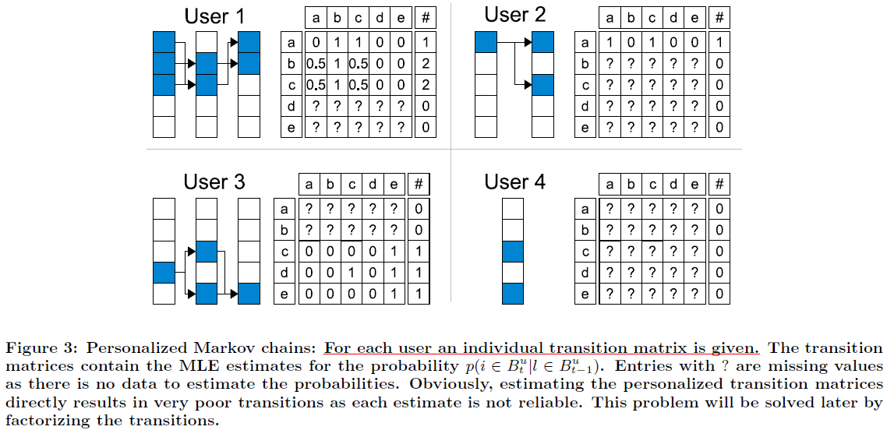

Factorizing Personalized Markov Chains for Next-Basket Recommendation
=========================================================================
这篇论文的作者就是大名鼎鼎的libFM的作者 Rendle. 

当然这篇文章出现在FM之前，所以，其中的稀疏矩阵的建模方面采用的是矩阵分解(MF)而不是FM，介绍的模型也是将MF融入到MC中。

当然，这部分应该是可以用FM去替代的。 关于模型，貌似乡亲们反响较好，特此做下阅读笔记。

Introduction
-------------
推荐算法里有两种典型的模型：

1. Matrix Factorization (MF): 通过对user-item的交互矩阵进行矩阵分解，为user和item的各自的相似特性建模
2. Markov Chains (MC): 基于统计，将用户购买的序列组织成一个Markov链来捕捉user的序列化的习惯

两者都各有优势，这篇论文就将两者的优点结合在一起，提出了一个新的模型：factorized personalized MC (FPMC) .

MC
***
基于用户最近的行为(n-gram)来预测用户的下个购买行为.

在建模过程中，会建立一个item to item的转移矩阵。 这个转移矩阵是全局的，每个user都相同(因为数据太稀疏，必须融合所有人的购买行为？)

MF
***
MF 通过分解，可以为每个user/item建立一个vector来刻画他们，以更低的维度来刻画他们间的相似特性和属性(类似word2vec的产物)。

这两种模型中，MC能够在宏观上刻画item按照时间序列上被购买的规律; 而MF能够在整体数据上，刻画每个user的喜好。

一些优化点：

1. 用MF来建模转移概率，这样能够在比较稀疏的数据上充分融合相似user的信息（相当于数据降维，降低稀疏度)。
2. MF基于pairwise interactions，这样可以将一个巨大的矩阵降维成两两矩阵的乘积（充分利用中间量的相似特性建模)，更好应对稀疏数据。

Item Recommendation from Sequential Set Data
------------------------------------------------
现在的购物网站，比如淘宝，用户每次购买行为是 "购物篮"(basket) 为单位。

一个basket里会包含有很多的商品，这篇文章介绍的模型也是以 basket 为单位。

MC缺点
*******
类似于n-gram的滑动窗口，MC缺少全局信息的把握，能够建模的也是一个局部的信息。

缺少对user全局购买行为会带来一些问题，比如这样一个案例：
Tom是一个科幻迷，非常喜欢看类似《变形金刚》这类科幻片。
但是，最近Tom的女朋友来了，于是买了一个《小时代》《匹夫》等片子留着和GF周末看。
基于MC的推荐，此后就会为他推荐《小时代N》了.

但是，如果掌握了一定的全局信息，那么给Tom继续推荐科幻电影是最讨巧的选择。

问题定义
***************
* User: :math:`U = \{ u_1, \cdots, u_{|U|}\}`
* Item: :math:`I = \{ i_1, \cdots, i_{|I|}\}`
* Personalized Basket: :math:`B^u := (B_1^u, \cdots, B_{t_u -1}^u)` 其中 :math:`B_t^u\in I` 是商品
* Basket: :math:`B := (B_1, \cdots, B_{t -1})` (所有user)

最终，推荐问题将会转化成一个personal ranking问题：

基于user第t此的basket，推荐top n items.

.. math::

    <_{u,t} \subset I^2

Factorizing Personalized Markov Chains (FPMC)
---------------------------------------------------

Personalized Markov Chains for Sets
*************************************
这里，basket实际上就是set。

这里只用一阶的MC，也就是现在购买的商品只基于之前的basket。

也就是：

.. math::
    :label: basket_transition

    p(B_t | B_{t-1})

由于basket是item的集合，细化到item层次，我们将转移过程一个转移矩阵来表示：
对于一个观测样本，item :math:`l \rightarrow i` 的转移概率定义为：

.. math::
    :label: basket_transition_item

    a_{l,i} := p(i\in B_t | l \in B_{t-1})

.. math::
    :label: basket_transition_cal

    p(i \in B_t | B_{t-1}) := \frac{1}{|B_{t-1}|} 
            \sum_{l \in B_{t-1}} p(i\in B_t | l \in B_{t-1})

而basket层次的转移概率就是其包含所有item转移概率之积。

.. math::

    p(B_t | B_{t-1}) \propto \prod_{i\in B_t} p(i|B_{t-1})

Estimation of Transition Probabilities
******************************************
下面用统计的方法来计算转移概率

.. math::

    \begin{split}
    \hat{a}_{l,i} & = \hat{p}(i\in B_t | l \in B_{t-1}) \\
                    &= \frac{\hat{p}(i\in B_t \wedge l \in B_{t-1})}
            {\hat{p}(l \in B_{t-1})} \\
                    &= \frac{|\{(B_t, B_{t-1}): i\in B_t \wedge l\in B_{t-1}\}|}
            {|\{ (B_t, B_{t-1}): l \in B_{t-1} \}|} 
    \end{split}

Personalized Markov Chains for Sets
***************************************
上一小节中的MC是基于所有user的数据的，或者说只在basket层次，没有user的概念。

下面将对单个的user建模:

.. math::

    p(B_t^u | B_{t-1}^u)

其中 :math:`B_t^u` 表示user :math:`u` 的第 :math:`t` 个basket.

类似地，转移概率的计算也限定到单个user的数据上，

.. math::

    \hat{a}_{u,l,i} & = \hat{p}(i\in B^u_t | l \in B^u_{t-1}) \\
                    &= \frac{\hat{p}(i\in B^u_t \wedge l \in B^u_{t-1})}
            {\hat{p}(l \in B^u_{t-1})} \\
                    &= \frac{|\{(B^u_t, B^u_{t-1}): i\in B^u_t \wedge l\in B^u_{t-1}\}|}
            {|\{ (B^u_t, B^u_{t-1}): l \in B^u_{t-1} \}|} 

也就是每个user有一个自己的transition matrix :math:`A^u` . 
所有user的转移矩阵维度总和是 :math:`A \in [0,1]^{|U|\times |I| \times |I|}`

.. note::

    总之，Personalized的意思就是，在单个user的history数据上单独建模一个MC
    这样，每个user都有属于自己的MC了

.. note::

    Personalized MC的训练数据巨稀疏，这时，MF的优势就显现出来了。

如图 `FPMC_tm2`_ 表示的是不同user的basket的转移。

如果将单个user每两个basket间的转移概率用概率矩阵的方式表达出来，可以构成如图 `FPMC_tm3`_ 的cube.

Limitations of MLE and Full Parametrization
**********************************************
上面章节中，我们计算的转移概率的参数数目：

MC是 :math:`|I|^2` ， Personalized MC 是 :math:`|U||I|^2` ，这样的参数称为Full Parametrization，数目比较大，
而且稀训练数据巨稀疏的情况下，Full Parametrization问题就很大了。 

MC采用MLE，但MLE的缺点是认为不同的user间是完全独立的，item也类似。
但是，事实是，物以类聚，人以群分。 

下面的章节将会使用MF来解决上面两个问题。 
通过对转移矩阵进行分解，打破参数之间独立性。

这样，每个转移过程都将受到相似user，相似item以及相似的转移的影响。

Factorizing Transition Graphs
------------------------------
采用MF，使用一个低阶的 :math:`\hat{A}` 来近似 :math:`A`

.. math::

    \hat{A} := C \times U^{V^U} \times L^{V^L}\times I^{V^I}
    
其中， 

* :math:`V^U` 是user的feature matrix
* :math:`V^L` 是用户最近购物的item的feature matrix
* :math:`V^I` 是被预测item的feature matrix

它们的维度如下：

.. math::
    
    C \in \mathbb{R}^{k_U, k_L, k_I}

    V^U \in \mathbb{R}^{|U|\times k_U}

    V^L \in \mathbb{R}^{|I|\times k_L}

    V^I \in \mathbb{R}^{|I|\times k_I}

由于 :math:`A` 非常稀疏，采用一种特殊的CD方法来建模pairwise interaction:

.. math::
    :label: basket_transition_MF

    \hat{a}_{u,l,i} := \langle v_u^{U,I}, v_i^{I,U} \rangle + 
                \langle v_i^{I,L}, v_l^{L,I}\rangle + 
                \langle v_u^{U,L}, v_l^{L,U} \rangle

对于CD(cube decomposition)，可以看看下图(from *Numerical Algorithms for Tensor Decomposition* ).

宏观上，捕捉的pairwise关系如下：

* :math:`U` and :math:`I`
* :math:`U` and :math:`J`
* :math:`J` and :math:`I`

Summary of FPMC
********************
上面章节讲到了Personalized MC，对单个user的basket购物行为序列建模; 以及Transition Cube的分解，可以对转移概率作低纬近似。

那么，将两者合并起来，就是FPMC了。

结合 :eq:`basket_transition` :eq:`basket_transition_item` :eq:`basket_transition_MF` :eq:`basket_transition_cal` 可以得到：

.. math::
    :label: hat_x

    \begin{split}
    \hat{p}_{i\in B_t^u | B_{t-1}^u} & = \hat{p}(i\in B^u_t | l \in B^u_{t-1}) \\
        & = \frac{1}{|B^u_{t-1}|}  \sum_{l\in B^u_{t-1}} 
            \left( 
                 \langle v_u^{U,I}, v_i^{I,U} \rangle + 
                 \langle v_i^{I,L}, v_l^{L,I}\rangle + 
                 \langle v_u^{U,L}, v_l^{L,U} \rangle
            \right) \\
        & = \langle v_u^{U,I}, v_i^{I,U} \rangle + 
            \frac{1}{|B^u_{t-1}|}  \sum_{l\in B^u_{t-1}} 
                \left( 
                     \langle v_i^{I,L}, v_l^{L,I}\rangle + 
                     \langle v_u^{U,L}, v_l^{L,U} \rangle
                \right)
    \end{split}

Item Recommendation from Sequential Set Data with FPMC
--------------------------------------------------------
上面的构建了FPMC的理论框架，但回归本真，最终应对的是一个推荐问题。 

给定一个用户的basket购买历史，以及候选的item集合，
需要能够预测出该user下一个basket中的item集合并提前推荐给他。 

当然，直接按照上面的公式可以计算出每个候选item的概率，通过概率取Top N也是可取的。 

但Randle将原始问题转化为一个Rank的问题，优化了计算复杂度。

Optimization Criterion S-BPR
*********************************
所谓的Rank问题，就是对预测结果进行一个排序。 

在学习的时候，保证在Next basket中的item的概率(得分)比不在next basket中的item的概率高就可以了。
如此来更新参数，最终模型能够对item是否在next basket 中有一个很好的区分度。

Rank 模型定义：

.. math::

    i >_{u,t} j :\Leftrightarrow \hat{x}_{u,t,i} >_{\mathbb{R}} \hat{x}_{u,t,j} 

其中的 :math:`>_{u,t}` 就表示为 Rank 模型，只要学习到两两的顺序，
最终就能够对整体的顺序 :math:`>_\mathbb{R}` 有一个把握。

引入到后验概率:

.. math::

    p(\Theta | >_{u,t}) \propto p(>_{u,t} | \Theta) p(\Theta)

其中， :math:`\Theta` 是模型参数 :math:`\Theta = \{ V^{U,I}, V^{I,U}, V^{L,I}, V^{I,L}, V^{U,L}, V^{L,U} \}`

假定basket和user间相互独立，则最大后验（MAP）定义如下：

.. math::

    arg\max_{\Theta} \prod_{u\in U} \prod_{B_t\in B^u} p(>_{u,t} | \Theta) p(\Theta)

具体的计算，类似于pairwise rank，对于所有的 item-pairs :math:`(i,j) \in I^2` ，
其中 :math:`i\in B_t` ，:math:`j\notin B_t`

进一步演算：

.. math::
    \begin{split}
    p(i >_{u,t} j | \Theta) &= p(\hat{x}_{u,t,i} >_\mathbb{R} \hat{x}_{u,t,j} | \Theta) \\
                            &= p(\hat{x}_{u,t,i} - \hat{x}_{u,t,j} >_\hat{R} 0 | \Theta)
    \end{split}

将具体的顺序表达为正负，如果 :math:`i >_\mathbb{R} j` ，则 :math:`i-j` 为正，否则为负。 

进一步将正负的关系通过 *sigmoid* 函数 :math:`\sigma` 转化为概率。

.. math::
    p(i >_{u,t} j|\Theta) = \sigma(\hat{x}_{u,t,i} - \hat{x}_{u,t,j})

sigmoid函数是值域为 :math:`(0,1)` 的单调增。可以保证正确顺序的pair对越多，score越大。

综合起来，最终的目标函数是：

.. math::
    \begin{split}
    &   arg\max_\Theta \ln p(>_{u,t} | \Theta) p(\Theta)  \\
    &=  arg\max_\Theta \ln \prod_{u\in U} \prod_{B_t\in B^u} \prod_{i\in B_t} \prod_{j\notin B_t}
    \theta(\hat{x}_{u,t,i} - \hat{x}_{u,t,j})p(\Theta) \\
    &=  arg\max_\Theta \ln \sum_{u\in U} \sum_{B_t\in B^u} \sum_{i\in B_t} \sum_{j\notin B_t}
        \ln \theta (\hat{x}_{u,t,i} - \hat{x}_{u,t,j}) - \lambda_{\Theta} ||\Theta||^2_F
    \end{split}

References
-----------
.. [factorizing] Factorizing Personalized Markov Chains for Next-Basket Recommendation
.. [tensor-decomposing] Numerical Algorithms for Tensor Decomposition
