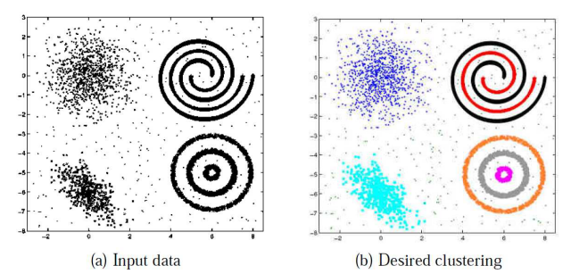
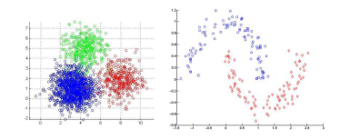
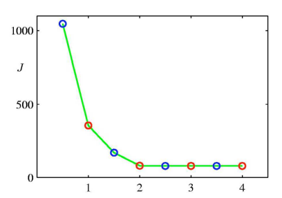
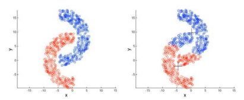
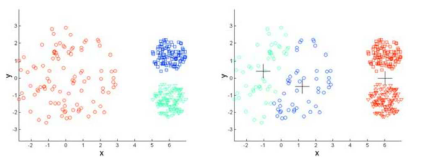
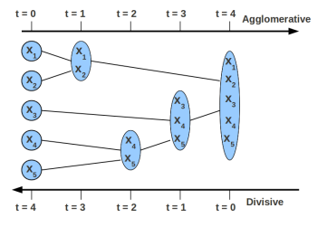

================
K-means 和 层次聚类
================
.. sectionauthor:: Superjom <yanchunwei {AT} outlook.com>

|today|

聚类
------
聚类是非监督学习，在于重构数据或者挖掘数据中的结构。

给定一批数据 :math:`\{ X_1, X_2, \cdots, X_n\}`  ， 和希望划分的类别数 :math:`K` ，
最终的目标是， 将输入数据划分为 :math:`K` 部分。

聚类方法用到的唯一的信息就是item之间的相似度。 

一个好的聚类结果能够达到如下要求：

1. 类别内高相似度
2. 类别间低相似度

要进行聚类，相似度计算方法非常重要。

通过计算item间的距离来衡量相似度，一般有如下三种方式来定义距离：

1. 欧氏距离： :math:`d(X,Z) = ||X-Z|| = \sqrt{\sum_{d=1}^D (X_d - Z_d)^2}`
2. 曼哈顿距离: :math:`d(X,Z) = \sum_{d=1}^D |X_d - Z_d|`
3. 核距离： :math:`d(X,Z) = ||\phi(X)  - \phi(Z)||` ，其中， :math:`\phi` 是映射

不同的距离计算方式适合不同的数据分布：

上图，左边适合采用欧氏距离，右边可以用核距离区分出。

K-Means聚类
-----------
k-means 算法尝试找出每个cluster的中心点，而其他点以距离最近的中心点作为其类别。

初始时，中心点随机选取，之后遍历所有点，重新选取直到稳定为止。

算法
*********
1. Input: 

    1. :math:`N` 个数据： :math:`\{ X_1, X_2, \cdots, X_n\}`
    2. 类别数 :math:`K`

2. 初始化： 随机选取 :math:`K` 个点作为cluster的中心点: 
   :math:`\{\mu_1, \mu_2, \cdots, \mu_K\}`    

3. 迭代直至中心点稳定：

    1) 对于每个点，归类到离它最近的中心点的类别 :math:`k = arg\min_k ||X_n - \mu_k||^2`

    最终形成的 :math:`K` 个cluster为：

    .. math::

        C_k = \{X_n | k = arg \min_k ||X_n - \mu_k ||^2\} , k = 1, \cdots, K

    2) 对于每个cluster，计算并更新新的中心点
        
    .. math::
        
        \mu_k = \frac{1}{C_k} \sum_{n\in C_k} X_n
    
        
目标函数
**********
定义 :math:`r_{nk}\in \{0,1\}` 是一个指示函数（indicator) 来判定 :math:`X_n` 是否属于 cluster :math:`k` 。

如此目标函数是：

.. math::

    J(\mu, r) = \sum_{n=1}{N} \sum_{k=1}^K r_{nk} ||X_n - \mu_k ||^2

.. note::

    优化这个目标函数是一个NP难问题，意味着，之前介绍的算法尽管能够得到一个最终的结果，
    但肯定是局部最优的。

选择合适的类别数K
********************
一种方法是尝试不同的K，画图看看

可以看到上图 :math:`K=2` 是一个合适的设定。

问题和注意事项
*******************

初始化
+++++++

上面有讲到，K-means算法仅能找到目标的一个局部最优点。

**初始化时中心点的选择对于聚类的效果至关重要。**

差的初始化会导致：

1. 收敛的速度很慢
2. 差的聚类效果   

一种可选的初始化方法是：

1. 首先随机选择第一个中心点 :math:`\mu_1` ， 然后选取离 :math:`\mu_1` 最远的一个点作为第二个中心点 :math:`\mu_2` ， 以此类推。

2. 选取不同的初始化方案，最终选择其中效果最好的（目标函数最小的）

硬分配(hard assignment)
++++++++++++++++++++++++++
k-means中的一个点仅可以归类到一个类别中，不可能归类到多个类别。
这与层次聚类方法很不同。

对很远的离群点敏感
+++++++++++++++++++
很远的离群点将会直接影响k-means中的中心点的选取，
一个包含离群点的cluster的中心点将远离对应的稠密区的中心点。

对于这个问题，可以将mean(平均)操作替换成median(中位数)操作。
中位数操作对离群点更加robust。

对于一些cluster效果差
+++++++++++++++++++++++++++++
比如，非凸的shape：

或者有不同density的cluster：

其中，左边为正确的聚类，右边为kmeans聚类的效果。

k-means++
-------------
k-means++ 主要是对kmeans中初始化时的随机cluster中心的选择做的改进。 

上面已经讲到了，初始化的中心点至关重要。 
好的初始化点（如果恰好就是最终的cluster中心那就更好了）能够极大地提高训练速度。
如果选择的cluster中心都在一个很小的局域（概率比较小，但是客观可能），那这个训练时间可想而知。

k-means++ 的思想是，初始选择的几个cluster中心需要尽可能远。

具体的算法如下：

1. 先从数据库中随机挑个点作为第一个seed
2. 扫描所有点x, 计算其与最近的聚类中心的距离 D(x).
3. 选择一个新的点作为新一个cluster中心，选择原则是， D(x) 较大的点，被选择的概率较大
4. 重复2,3步直到k个聚类中心被选出来
5. 进行标准的k-means算法

第3步中有讲到，被选中的概率与D(X)有关系。 
采用一个方法将D(X)与概率联系起来（有点像word2vec中， NCE中的噪音词的选择方法（与词频相关）)：

1. 对于每个点，将对应的 D(X) 保存到一个数组中，然后将这些距离加起来得到Sum(D(X))
2. 去一个Sum(D(x))范围内的随机数 Random
3. 从前向后扫描D(X)数据，每次用 Random -= D(X)，当Random<=0时，对应点就是需要选择的新的cluster中心。

上面第3步需要线性扫描数组。

这里插一下word2vec中Negative sampling 的随机噪音词的提取方法吧，原理是相同的，但是实现方式比较巧妙。

NCE认为噪音词被选中的概率分布有一个先验，
word2vec中先验取的是 :math:`f(w) = term(w)^{3/4}` ，
也就是词频的指数，这个先验可以人工选择，
大体意思是与词频有关，
词频高的词有更高的概率作为噪音被选中。

word2vec 中首先做了一个word table，构建方式如下：

1. 分配一个N（很大）长度的词表
2. 对于每个词w, 计算先验 :math:`f(w)` ，将所有的先验值求和 :math:`sum = \sum_{w \in V} f(w)` 
3. 从前往后扫描整个词库V，对于每个词，在word table 中按顺序分配 :math:`N\times \frac{f(w)}{sum}` (取整) 个空间，中间存储w的词库id。

在抽取噪音词时，随意取一个N之内的正整数rand，对应着取 word table[rand] 中存储的就是噪音词的id

层次聚类
----------
层次聚类与kmeans相比，有很多不同点。

比如之前讲到kmeans是hard assignment，那层次聚类就是 soft assignment，其特点就是一个点可以被分配给多个层次的cluster.

最终聚类的效果如下图：

算法
*****
层次聚类按照从上往下和从下往上两种方向有两种建立层次的算法：

凝聚（bottom-up)聚类
++++++++++++++++++++++
1. 初始化时，每个点自己构成一个cluster
2. 每次，贪心合并两个最相似（距离最近）的cluster
3. 重复2， 直至只包含一个cluster

拆分(top-down)聚类
++++++++++++++++++++++
1. 初始化时，所有的点属于一个共同的cluster
2. 每次，从凝聚程度最小的类别里去除一个点
3. 重复2， 直至每个cluster只包含一个点

凝聚聚类要比拆分聚类要更常用一点。

相似度定义
************
和k-means相似，距离定义也会直接影响到最终的聚类效果。

常用的有以下三种：

1. Min-link: 以两个cluster中最近点的距离作为两个类别的距离，会产生链，cluster可能变得很大

.. math::
    
    d(R, S) = \min_{X_R \in R, X_S \in S} d(X_R, X_S)

2. Max-link: 以两个cluster中最远点作为两个类别的距离，会产生小的原形的cluster。

.. math::

    d(R, S) = \max_{X_R \in R, X_S \in S} d(X_R, X_S)

3. Average-link: 两个cluster中点互相的距离的平均作为两个cluster的距离
    
.. math::

    d(R, S) = \frac{1}{|R||S|} \sum_{X_R \in R, X_S \in S} d(X_R, X_S)

K-means vs 层次聚类
------------------------
两者的比较：

* k-means最终只产生一种聚类，而层次聚类可以输出不同层次的聚类效果

* k-means需要预先给定cluster的数目，而层次聚类不需要

* k-means往往在聚类过程中比较高效，而层次聚类需要merge和split cluster，会慢一些

* 两者的精度尚没有充分的实验证明

References 
-----------

.. [kmeans] Piyush Rai, Data Clustering: K-means and Hierarchical Clustering
