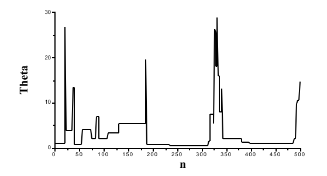

=========================
MCMC and Gibbs Sampling
=========================
.. sectionauthor:: Superjom <yanchunwei {AT} outlook.com>

|today|

最近复习LDA，详细看了下Gibbs采样的内容，做个笔记。

Monte Carlo Intrduction
---------------------------

Monte Carlo 积分
******************
传统的Monte Carlo 方法是物理学家通过产生随机数的来计算积分的方法。

比如，我们尝试计算一个复杂积分：

.. math::

    \int_a^b h(x) dx

如果可以将 :math:`h(x)` 分解为函数 :math:`h(x)` 
和一个定义在 :math:`(a,b)` 上的概率密度函数 :math:`p(x)`  :

.. math::

    \int_a^b h(x) dx = \int_a^b f(x) p(x) dx = E_{p(x)} [f(x)]

也就是，原有的复杂积分转化为 :math:`f(x)` 在密度函数 :math:`p(x)` 上的期望。

因此，如果我们可以随机抽出足够大的样本 :math:`x_1, x_2, \cdots, x_n` ，
就可以用样本的期望来近似原始积分。

.. math::

    \int_a^b h(x) dx = E_{p(x)} [f(x)] \simeq \frac{1}{n} \sum_{i=1}^n f(x_i)

这就是所谓的 **Monte Carlo intergratioin** .

Monte Carlo 积分可以用来近似后验分布。

Importance Sampling
*********************
假设密度函数 :math:`p(x)` 近似密度函数 :math:`q(x)` ， 有

.. math::

    \int f(x) q(x) dx = \int f(x) 
            \left( 
            \frac{q(x)}{p(x)} 
            \right)
            p(x)dx
        = E_{p(x)} \left[ 
            f(x) \left( 
            \frac{q(x)}{p(x)} 
            \right)
            \right]
        
上述公式构成了 **importance sampling** 的基础：

.. math::

    \int f(x) q(x) dx \simeq \frac{1}{n} \sum_{i=1}^n f(x_i) 
        \left( \frac{q(x_i)} {p(x_i)} \right)

如果要计算 :math:`y` 的边缘密度, :math:`J(y) = \int f(y|x) q(x)dx` ， 
可以采用如下方式近似:

.. math::

    J(y) \simeq \frac{1}{n}
        \sum_{i=1}^n f(y|x_i)
            \left(
                \frac{q(x_i)}{p(x_i)}
                \right)

Introduction to Markov Chains
----------------------------------
下面对马尔科夫链做一些介绍。

Markov Chain的定义如下：

.. math::

    Pr(X_{t+1} = s_j | X_0 = s_k, \cdots, X_t = s_i)
        = Pr(X_{t+1} = s_j | X_t = s_i)

也就是，状态转移的概率只基于前一个状态，与更早的历史状态无关。

一个 Markov Chain 是一个Markov process 产生的随机值的序列  :math:`(X_0, \cdots, X_n)` 。

定义状态转移概率：

.. math::

    P(i,j) = P(i \rightarrow j) = Pr(X_{t+1} = s_j | X_t = s_i)

定义在时间t状态为i的概率： 

.. math::

    \pi_j(t) = Pr(X_t = s_j)

下面，我们来模拟一个Markov Chains 的Markov process。

首先，定义初始状态： :math:`\pi(0)` ，一般的初始状态设置为，只有一个元素为1，其他元素均为0。

那Markov Chain在时间 :math:`t+1` 处在状态 :math:`i` 的概率是:

.. math::
    
    \begin{split}
    \pi_i(t+1)  &=  & Pr(X_{t+1} = s_i) \\
                &=  & \sum_{k} Pr(X_{t+1} = s_i | X_t = s_k). Pr(X_t = s_k) \\ 
                &=  & \sum_{k} P(k \rightarrow i) \pi_k(t)  = 
                    \sum_k P(k,i) \pi_k(t) 
    \end{split}

定义一个状态转移矩阵 :math:`P` ，使得第 :math:`i,j` 元素是 :math:`P(i,j)` 

.. note::

    .. math::
    
        \sum_k P(k,i)=1 

上述同时就变成：

.. math::

    \pi (t+1) = \pi (t) P

可以简单地得到如下公式：

.. math::

    \pi(t) = \pi(0) P^t

对于 :math:`P^n` 中元素的解释是：

.. math::

    p_{ij}^{(n)} = Pr(X_{t+n} = s_j | X_t = s_i)

也就是状态i 通过n步（时间）得到状态j的概率。

Example 1
*********
一个天气的例子，加入只有三种天气： (Rain, Sunny, Cloudy)，
天气的变化遵循一个Markov process.

天气的转移矩阵是：

.. math::

    P = 
    \begin{pmatrix} 0.5 & 0.25 & 0.25 \\ 0.5 & 0 & 0.5 \\ 0.25 & 0.25 & 0.5\end{pmatrix}

那假如今天是sunny， 也就是 :math:` \pi(0) = (0 , 1, 0)` ，那两天后的天气的概率是：

.. math::

    \pi(2) = \pi(0) P^2 = 
        \begin{pmatrix}
        0.375 & 0.25 & 0.375
        \end{pmatrix}

7天后的概率是：

.. math:: 

    \pi(7) = 
        \begin{pmatrix}
        0.4 & 0.2 & 0.4
        \end{pmatrix}

对比 :math:`\pi(2)` 和 :math:`\pi(7)` ，会发现两者比较相近，
事实上，:math:`\pi(t)` 会在随着t增大而收敛。

也就是：

.. math::

    \pi^* = \pi^* P

细致平稳条件
************
如果Markov Chains的转移矩阵 :math:`P` 和分布 :math:`\pi(x)` 满足

.. math::
    
    \pi(i) P_{ij} = \pi(j) P_{ji} 

对于所有的 :math:`i,j` 均成立，那么 :math:`\pi(x)` 就是Markov Chain 的平稳分布。

Metropolis-Hasting 算法
--------------------------
使用 Monte Carlo 积分的一个问题是如何取得 :math:`p(x)` 的随机样本，
这是采用MCMC的关键。

比如，我们要抽样 :math:`p(\theta)` 的样本，其中， :math:`p(\theta) = f(\theta) / K` 。
正则化项 :math:`K` 不可知，或者很难被求出。

Metropolis 算法以如下方式抽取该分布的样本:

1. 设置初始化值 :math:`\theta_0` 满足 :math:`f(\theta_0) > 0`
2. 使用当前的 :math:`\theta` , 基于转移概率 :math:`q(\theta_1, \theta_2)` 产生下个状态的候选值 :math:`\theta^*`, 转移概率必须是对称的： :math:`q(\theta_1, \theta_2) = q(\theta_2, \theta_1)`
3. 得到候选状态 :math:`\theta^*` ， 计算比值

   .. math::
    
        \alpha = \frac{p(\theta^*)}
                    {p(\theta_{t-1})}
            = \frac{f(\theta^*)/K} {f(\theta_{t-1}/K}
            = \frac{f(\theta^*)} {f(\theta_{t-1}}

    这里巧妙的一点，就是避开了K的计算 。
4. 以概率 :math:`min(1, \alpha)` 接受候选 :math:`\theta^*` 并重复2 

可以如下，将 :math:`\alpha` 转化为概率：

.. math::

    \alpha = \min  \left(
        \frac{f(\theta^*)} {f(\theta_{t-1})}
        ,1 \right)
  
Example 2
***********
加入我们要模拟如下分布：

.. math::

    p(\theta) = C. \theta^{-n/2} . \exp 
                \left( \frac{-\alpha}{2\theta} \right)

其中，:math:`n=5, a=4`

我们设定，转移概率函数是一个在 :math:`(0, 100)` 上的平均分布。

首先，初始化 :math:`\theta_0 = 1` ， 通过平均分布（转移概率函数）得到，
下个候选 :math:`\theta^* = 39.82` ，得到

.. math::

    \alpha = min(\frac{p(39.82)}{p(1)}, 1) = 0.0007

这代表， :math:`\theta^*` 有 0.0007 的概率被拒绝（维持之前的值）。

前500 个取值如下图：

可以看到中间有很多的取值都被拒绝（水平的部分），这种现象叫做 **poorly mixing** .

Metropolis-Hasting Sampling as a Markov Chain
************************************************

