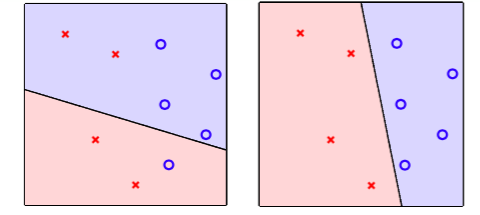

Machine Learning Foundations -- Lesson 2 Learning to Answer Yes/No
==================================================================

机器学习的一个定义
-------------------

机器学习从资料开始，资料是来源于一个未知的分布 :math:`f` (真实的分布函数)

我们将资料提供给一个 `演算法` ，演算法会从所有可能的分布中(假设集 :math:`H` ) 中，选取一个最接近 :math:`f` 的分布 :math:`g` 。

现在面向一个实际的应用 -- 银行的信用卡发放。

当实际开始决策时，我们将申请者的资料喂给 :math:`g` ，然后由 :math:`g` 输出一个决策结果 :math:`y` ，来表示yes/no。

感知器
------
上面有假设集( :math:`H` )这个概念，下面接触一个具体的模型：感知器

对于一个用户的特征 :math:`X = (X_1, X_2, \cdots, X_d)` ， 计算一个加权分

.. math::

    score = \sum_{i=1}^d W_i X_i 

如果 :math:`score > threshold` ，则同意派发信用卡，否则，则拒绝。

.. note::
    
    这里X是申请者的特征，每一纬度代表一份信息，比如age、annual salary可以代表其中两个纬度等。

    而W可以认为是X每个纬度的重要性。

    如果某个特征的纬度对区分度的贡献越大，那么可能此纬度对应的W(绝对)数值越大。

这里的假设集 :math:`H` 被设定为线性公式的样子: :math:`h \in H` 

具体格式是

.. math::

    h(x) = sign \left( \left( \sum_{i=1}^d W_i X_i \right) - threshold \right)

可以对这个公式进行化简：

.. math::

    \begin{split}
    h(x) &= sign \left( \left( \sum_{i=1}^d W_i X_i \right) - threshold \right) \\
         &= sign \left( \left( \sum_{i=1}^d W_i X_i \right) + (-threshold)(+1)\right) \\
         &= sign \left( \sum_{i=0}^d W_i X_i \right) ; X_0 = -threshold
    \end{split}
        
二维空间上的具体情况 
---------------------
为了能够直观地看到假设集的情况，我们可以限定特征纬度为二，从而决策的过程可以映射到一个二维平面空间中。

如图所示，『叉』和 『圆』两种点代表了两个类型： Yes / No

学习/训练的目标就是，找出一条直线能够很好地将这两种点拆分开来。

此时的假设集就是直线：

.. math:: 

    h(X) = sign( W_0 + W_1 X_1 + W_2 X_2)

其中， :math:`W` 就是具体的模型参数，学习的过程就是选择好的 :math:`W` 来控制直线最好地区分两种不同的点。

从假设集上选出 g
------------------
由上面一节，我们可以认为，对于二维特征，假设集就是二维平面上的线。

那么，我们如何定挑选 :math:`g` 的标准呢？ 

我们希望 :math:`g` 尽可能地接近于真实分布 :math:`f` ，那这样就可以要求，
至少在目前已有的资料上， :math:`g` 的预测很接近 :math:`f` 的预测（真实的标签）。

这样，我们就可以用在已有的资料上的效果来评估假设 :math:`g` 了。

但有一个问题是，假设集可能是无穷大的 -- 在二维空间上，有无穷多条线，从哪条线开始，到哪条线结束呢？ 

一种可取的方式就是，从一条线 :math:`g_0` 开始，之后不断修正这条线，不断提升其效果。

感知器学习算法
---------------
感知机的学习始于对错误点的纠正过程。

首先明确错误点：

就是在现有假想 :math:`g` 下，预测错误的点。

也就是

.. math::

    sign \left( W_t^T X_n(t) \right) \neq y_n(t)

纠正(学习)的过程就是

.. math::

   W_{t+1} \leftarrow W_t + y_n(t)X_n(t)

.. note::

    这个个人理解是，宏观上的优化目标应该是 max L = WXy
    有点间隔最大化的感觉。 

    这样，求导数， \partial{L} {W} = Xy

如此，不断对错误点进行修正更新，直到不犯错误为止。

下面进行算法的具体描述：

对于一个资料 :math:`D` ， 一个初始的参数 :math:`W_0` 

循环进行如下过程：

扫描 :math:`D` 中的每个点，找到下一个预测错误的点 :math:`\left(X_n(t), y_n(t) \right)` ，此时对应的参数为 :math:`W_t`

.. math::

    sign \left( W_t^T x_n(t) \right) \neq y_n (t)

随后对这个错误点进行修正：

.. math::

    W_{t+1} \leftarrow W_t + y_n(t) X_n(t)

循环上面的过程，直到没有错误为止。

那么，下面有一些对于PLA的遗留问题：

1. 上面说在没有错误的时候，算法就会停止，那么算法一定会停止吗？ 
2. 是否会无限循环（总有错误）
3. 在 :math:`D` 上OK，那么在训练集外效果有保障吗?

PLA停止条件的讨论
-----------------
PLA的学习过程就是不断纠正错误点的过程，最终在所有点都划分正确的时候停止。

那么，如果给一个无法线性可分的资料，那么算法永远无法停止。

现在假设一个资料是线性可分的-- 存在一条线能够完美地划分资料。

首先，我们探讨下，最终的理想的直线的特性 :math:`W_f` 就是目标直线 :math:`f` 的参数，它能够很好地拆分资料：

由于如果点正好处在直线上的情况是无意义的（现实情况中，比例极小，可以随机化分配），我们可以假设不存在任何点正好处在直线上。

这样，能够得到如下：

.. math::

    \min_n y_n W_f^T X_n > 0

.. note::

   由于是正确拆分，所以 :math:`sign(W_f^T X_n) = y_n` ，所以 :math:`y_n W_f^T X_n \ge 0` 
   再因为所有点都不存在于线上，因此 :math:`>0`

在PLA的算法，有如下特性：

对于分类正确的点，有

.. math::

   y_n(t)W_t^T X_n(t) \ge \min_n y_n W^T_f X_n > 0

.. note::

   这点，对于分类正确，比如 :math:`y_n=+1，W^T_f X_n > 0, 于是有 y_n W^T_F X_n > 0`

