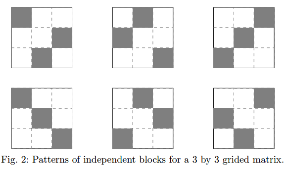
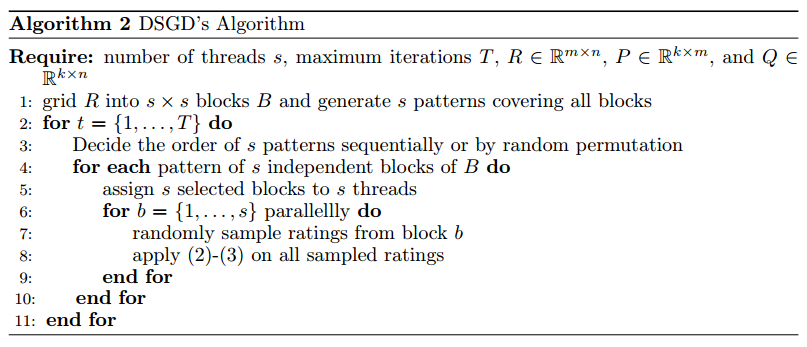
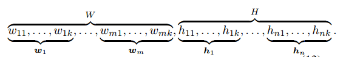
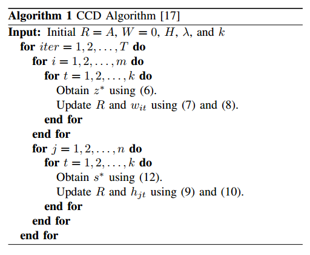
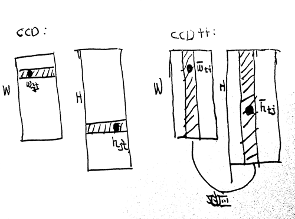
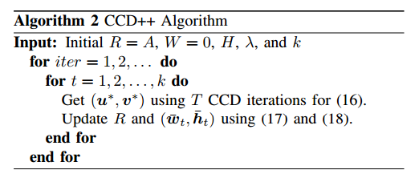

矩阵分解的并行梯度下降方法(Parallel Stochastic Gradient Method for Matrix Factorization)
=========================================================================================
前面的SVD模型，在单机上可以运行的很好。 
但是如果要并行化，比如单线程或者集群运行，那就需要考虑一些并行方面的问题（比如同步、内存共享和更新等）。

SVD模型
----------
回忆一下之前介绍的SVD模型。 

SVD是推进系统里，预测user对item打分 :math:`r_{u,v}` 的一个模型，有如下目标：

.. math::

    Loss(P,Q) = \sum_{(u,v)\in R} 
            \left(
                (r_{u,v} - p_u^T q_v)^2 + \lambda_p ||p_u||^2 
                + \lambda_Q ||q_v||^2 
                  \right).

    \min_{P,Q} Loss(P, Q)

其中， :math:`P, Q` 分别是user和item对应的潜在因素矩阵（latent-factor matrix)。 
:math:`p_u` 和 :math:`p_v` 分别对应着 :math:`P, Q` 中的一个vector。

注意，标准的梯度下降法中，利用矩阵操作，对所有的记录求解偏导数。

这样的方法精度高，但是运算中对时间和内存都有很大的要求。

并行的核心是任务的拆分，标准的梯度下降法不适合于并行化，而且，由于 :math:`u,v` 打分矩阵是一个极度稀疏的矩阵，对矩阵运算并行化也并不可行。

随机梯度下降法(Stochastic Gradient)
-------------------------------------
随机梯度下降的意思是，梯度更新时，不是一次性对所有数据进行运算，而是随机选择打分对 :math:`(u,v)`  ，计算梯度并对参数举证进行更新。

比如，从打分集合中取出了打分对：:math:`(u,v)` 以及相应的打分 :math:`r_{u,v}` :

.. math::

    (r_{u,v} - p_u^T q_v)^2 + \lambda_p p^T_u p_u + \lambda_Q q_u^T q_v

对应的梯度跟新：

.. math::
    :label: sg-update

    p_u \leftarrow p_u + \gamma (e_{u,v}q_v - \lambda_P p_u)

    q_v \leftarrow q_v + \gamma (e_{u,v}p_u - \lambda_Q q_v)

其中， :math:`e_{u,v}` 是真实score和预测score的差

.. math::

    e_{u,v} = r_{u,v} - p_u^T q_v

:math:`\lambda` 是学习参数。

随机梯度下降能够提高训练的速度，最终的效果能够接近全局最优。

尽管SG能够应用于矩阵分解，并且把原始的对整个数据集的学习拆分成了一次只对一个打分进行训练。

对但是其依旧无法直接并行化，原因是锁机制。
当对一个打分学习完毕，要更新全局参数 :math:`P,Q` 时，为了防止读写冲突（防止读过期的数据），或者重写，需要对全局数据添加锁。

并行的实质是让各个运行单元持续不断运行，全局锁会阻断大部分单元的读、写需求。

HogWild
---------
HogWild主要是将SG并行化（对稀疏矩阵有效）。

HogWild认为，由于打分矩阵 :math:`(u,v)` 的极度稀疏（一个user只会对少数几个item打分，而user以及item的数量是非常巨大的）,
那么操作 :eq:`sg-update` 极有可能是相互独立的操作（所有的运行子单元在某个时刻更新的user，item之间没有交集）。

因此，不需要添加锁机制，直接更新就可以了。

但是，偶尔，还是会出现重写的情况（比如，thread-1 更新 :math:`(u_1, v_t)` , 
thread-2在更新 :math:`(u_1, v_m)` , 两个thread如果同时更新，那么 :math:`u_1` 的结果总会被覆盖掉一个），[converge-sparse-matrix]_ 证明了，在矩阵非常稀疏的情况下，即使发生了重写，最后结果也依旧能够收敛。

DSGD
-------
DSGD从另外一个方向来解决读写冲突问题（完全可以应对稠密矩阵）。

DSGD认为，在打分矩阵中，一些小块之间是完全不冲突的(没有共同的user和item)。

比如下图：

其中，在3X3中，可以有6中划分方式，可以是灰色部分的小块在并行训练时彼此发生不冲突。

突然想起了一个类似的问题： 七皇后？ 只要7个皇后彼此不共同x，y就不会冲突了。

如此，将整体的打分矩阵划分出 :math:`s \times s` 块，就可以将不冲突的块分给并行的程序去运行了， 一轮最多同时可以并行 :math:`s` 份。

DSGD的算法：

冲突
******
矩阵毕竟是非常稀疏的，可能不同块中的打分个数非常不均匀，这样就导致各个进程的运行时间不均匀。 
但是，如果其中一个进程跑的非常快（属于它的分区 :math:`u_s` 打分记录特别少），
那么这一轮其他所有进程跑完之前，这个进程就必须被闲置了（如果分配其他进程的分区给它，必然造成类似七皇后问题中的冲突）。

个人觉得，可以通过减小块分割的粒度（提高 :math:`s` )，每个进程可以在多个分块中选择，如此，应该能够解决冲突。

并行化
*******
DSGD 可以用于单机share-memory的并行，也可以用于集群上的并行。

如果是集群上的并行的话，那么初始的时候，把属于各个区块的数据分配一下，然后按照不冲突的原则运行起来。

设置一个全局的参数存储节点，其他的worker节点设立自己对所需全局数据的局部缓存。

每个区块在运行完毕之后，将本地的局部缓存于参数存储节点的全局参数进行更新。

在本轮所有worker运行结束之后，分配区块，并载入所需的全局系数作为局部缓存，继续运行。

CCD
-------
定义：

* :math:`A` 是目标矩阵
* :math:`A_{ij}` 是矩阵中的 :math:`(i,j)` 对应的元素
* :math:`\Omega_i` 表示在 :math:`i^{th}` 行中的可见元素的列id集合
* :math:`\bar{\Omega}_j` 表示在 :math:`j^{th}` 列中的可见元素的行id集合
* :math:`w_i^T` 表示 :math:`W` 中的第 :math:`i` 行
* :math:`\bar{w}_j` 表示 :math:`W` 中的第 :math:`j` 列

CCD方法里会用到坐标下降法，下面先介绍一下这个方法。

Coordinate descent(坐标下降法）
********************************

坐标下降法是一种非递归优化算法，在算法的每次迭代时，
固定其他维度，只改变其中一维得到局部最优解。 

比如，对于 :math:`f(x) = g(x) + \sum_{i=1}^n h_i(x_i)` 

其中， :math:`g` 和 每个 :math:`h_i` 都是凸的。

采用坐标下降法：

.. math::
    
    \begin{split}
    x_1^{(k)} & \in arg\min_{x_1} f \left( x_1, x_2^{(k-1)}, x_3^{(k-1)}, \cdots, x_n^{(k-1)} \right)\\
    x_2^{(k)} & \in arg\min_{x_2} f \left( x_1^{(k)}, x_2, x_3^{(k)}, \cdots, x_n^{(k)} \right) \\
    & \cdots \\
    x_n^{(k)} & \in arg\min_{x_n} f \left( x_1^{(k)}, x_2^{(k)}, \cdots, x_n \right)
    \end{split}

.. note::

    在用坐标下降法的时候，一次只能更新一个维度上的值（固定其他维度不变）

原理
******
加入，现在更新 :math:`w_{it}` ，而且其值可以被更新到 :math:`z` (一个未知数).

设定， :math:`k` 是两个子矩阵的维度， 
:math:`\Omega_i` 是矩阵 :math:`A` 第 :math:`i` 行对应的非空元素的数目。

固定其他左右维度的值，会得到只有一个变量 :math:`z` 的问题：

.. math::
    :label: min_z_f_z 

    \begin{split}
    \min_z f(z) & = 
        \sum_{j\in \Omega_i} 
            \left( 
                A_{ij} - (w_i^T h_j - w_{it}h_{jt}) - z h_{jt} \right)^2
                        + \lambda z^2 \\
        & = \sum_{j\in \Omega_i} 
            \left( 
                A_{ij} - (w_i^T h_j - w_{it}h_{jt} + z h_{jt}) \right)^2
                        + \lambda z^2
    \end{split}

这个形式也许有点乱，整理一下：

* :math:`w_i, h_j` 分别为矩阵分解后两个子矩阵 :math:`W, H` 中的列（向量）
* :math:`w^T h_j - w_{it}h_{jt} + zh_{jt}` 就是用变量 :math:`z` 替换了当前维度值 :math:`w_{jt}` ，来拟合矩阵中的值 :math:`A_{ij}`

.. math::
  
    \begin{split}
    w_i^T h_j - w_{it}h_{jt} + zh_{jt} & = \sum_{k} w_{ik}h_{jk} - w_{it}h_{jt} \\
    &= \sum_{k \neq t} w_{ik}h_{jk} + zh_{jt}
    \end{split}

对于这个一元二次方程，可以将 :math:`z` 直接求解出来

.. math::

    z^* = \frac{
        \sum_{j\in \Omega_i} (A_{ij} - w_i^T h_j + w_{it}h_{jt}) h_{jt}}
        { \lambda + \sum_{j\in \Omega_i} h^2_{jt}}

直接求解公式 :eq:`z*` 的复杂度是 :math:`O(|\Omega_i|k)` 。
对于比较大的 :math:`k` ，可以通过存储剩余矩阵(residual matrix) :math:`R` 来加速：

.. math::

    R_{ij} = A_{ij} - w^T_i h_j, (i,j) \in \Omega

相应地， 公式 :eq:`z*` 可以替换成如下形式

.. math::
    :label: z*

    z^* = \frac{
        \sum_{j\in \Omega_i} \left( R_{ij} + w_{it}h_{jt} \right) h_{jt}}
        {\lambda + \sum_{j\in \Omega_i} h^2_{jt}}

如此，计算 :math:`z^*` 的复杂度可以下降为 :math:`|\Omega_i|` .

在得到 :math:`z^*` 的值后，同样可以用 :math:`|\Omega_i|` 的复杂度来更新：

.. math::
    :label: update-z*

    R_{ij} \leftarrow R_{ij} - (z^* - w_{it}) h_{jt}, j \in \Omega_i

    w_{it} \leftarrow z^*

上面是更新 :math:`W` 的元素 :math:`w_{it}` ，对于另外一个矩阵 :math:`H` 的更新完全对称，下面直接列公式了。

.. math::
    :label: update-s*

    R_{ij} \leftarrow R_{ij} - (s^* - h_{jt}) w_{it}, i \in \bar{\Omega}_j

    h_{jt} \leftarrow s^*

.. math::
    :label: s*

    s^* = \frac{
        \sum_{i\in \bar{\Omega}_j} \left( R_{ij} + w_{it}h_{jt} \right) w_{it}}
        {\lambda + \sum_{i\in \bar{\Omega}_j} w^2_{it}}

利用坐标下降法来更新两个向量。

更新顺序如下：

具体的算法：

算法中的公式对应着： :eq:`z*` :eq:`update-z*` :eq:`s*` :eq:`update-s*`

CCD++
---------
CCD++ 以feature为单位，而CCD以向量为单位。

.. math::

    A \approx W H^T = \sum_{t=1}^k \bar{w}_t \bar{h}_t^T

其中， :math:`\bar{w}_t` 是矩阵 :math:`W` 的第 :math:`t` 列， 
:math:`\bar{h}_t` 是矩阵 :math:`H` 的第 :math:`t` 列。

加入C++要更新feature :math:`t` ， 那么就需要更新 :math:`\bar{w}_t, \bar{h}_t` .

CCD++ 的目标函数是

.. math::

    \min_{u\in \mathbb(R)^m, v\in \mathbb(R)^n}
        \sum_{(i,j)\in \Omega}
            (R_{i,j} + \bar{w}_{ti} \bar{h}_{tj} - u_i v_j)^2
            + \lambda(||u||^2 + ||v||^2)

其中， :math:`u,v` 的角色与 :eq:`min_z_f_z` 中的:math:`z` 的角色是相同的，算是两个未知数。

如果定义 :math:`\hat{R}` :

.. math::
    
    \hat{R}_{ij} = R_{ij} + \bar{w}_{ti} \bar{h}_{tj}, (i,j) \in \Omega

那么目标函数就可以写成：

.. math::
    :label: hat_R
    
    \min_{u\in \mathbb(R)^m, v\in \mathbb(R)^n}
        \sum_{(i,j)\in \Omega}
            (\hat{R}_{i,j} - u_i v_j)^2
            + \lambda(||u||^2 + ||v||^2)

中间求解，可以将 CCD用到 :eq:`hat_R` 上，中间更新的顺序如下：

.. math::

    u_1, u_2, \cdots, u_m, v_1, v_2, \cdots, v_n

更新：

.. math::
    :label: update-hat_R

    \begin{split}
    R_{ij} & \leftarrow \hat{R}_ij - u_i^* v_j^*, (i,j) \in \Omega \\
    (\bar{w}_t, \bar{h}_t) & \leftarrow (u^*, v^*) 
    \end{split}

更新的次序是：

.. math::
    :label: ccdpp-update-sequence

    \bar{w}_1, \bar{h}_1, \cdots, \bar{w}_t, \bar{h}_t, 
    \cdots, \bar{w}_k, \bar{h}_k

注意，feature列 :math:`\bar{w}, \bar{h}` 中的对应关系。

CCD++具体的算法是

算法中的公式(16)是本文中的 :eq:`hat_R` ， 公式(17) (18) 是本文中的 :eq:`update-hat_R`

确实，从公式 :eq:`ccdpp-update-sequence` 和图片 :ref{fig-ccd-update-sequence} :ref{fig-ccdpp-ccd-difference} 初看起来，
CCD++ 和 CCD的区别就是更新的次序不同，但是更新次序直接影响到最终的收敛效果。

多核并行
**********
在进行CCD++ 的多核并行是，需要避免各个核之间的交流（获取最新的值）。

CCD++中需要多核并行的计算集中在 :eq:`hat_R` ，在求解时，用到坐标下降法，需要固定其他值，对 :math:`u` 或者 :math:`v` 进行求解。

如果，我们固定 :math:`v` 的值，可以通过公式 :eq:` :math:`u` 的过程可以独立地用公式 :eq:`z*` :eq:`update-z*` 求解。

因为 :math:`u` 中各个元素之间是相互独立的，当分到不同的核上运行时，之间没有交集。

因此，给定一个 :math:`p` 个核的机器，我们能够把任务分给这 :math:`p` 个核上运行。

指定 :math:`W` 行号的划分 :math:`S = \{S_1, S_2, \cdots, S_p\}` ，
对应着这个划分，将 :math:`u` 也划分为 :math:`p` 份：
:math:`u^1, u^2, \cdots, u^p` ，其中 :math:`u^*` 可以认为是 :math:`u` 的子向量。

将 :math:`u` 的划分分配到各个核上，每个核上分配一份。

每个核进行操作:

updates :math:`u_i` by :eq:`z*` and :eq:`update-z*`, for :math:`i \in S_r`

对于 :math:`H` 的并行方法也是类似的。 

在一台机器上的所有的核共享内存，各个核之间没有信息的交流。 

同时，差别矩阵 :math:`R` 核 :math:`(\bar{w}^r_t, \bar{h}_t^r)` 的值也会被并行地更新。

.. math::

    \begin{split}
    R_{ij} & \leftarrow R_{ij} + \bar{w}_{ti} \bar{h}_{tj} - u_i v_j, (i, j) \in \Omega_{S_r} \\
    (\bar{w}_t^r, h_t^r) & \leftarrow (u^r, v^r)
    \end{split}

    

References
-------------
.. [converge-sparse-matrix] Hsieh C J, Dhillon I S. Fast coordinate descent methods with variable selection for non-negative matrix factorization[C]
.. [ccd_pp] Yu, Hsiang-Fu, et al. "Scalable Coordinate Descent Approaches to Parallel Matrix Factorization for Recommender Systems." ICDM. 2012.
.. [coordinate-descent] Coordinate descent, Wikipedia 
