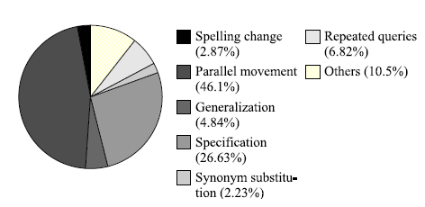
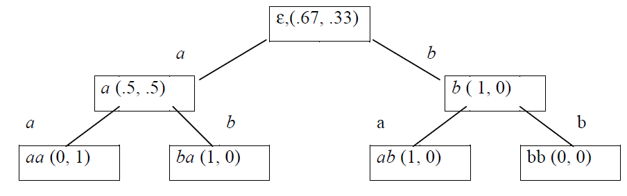

Query Suggestion(1) —— VMM
=============================
.. sectionauthor:: Superjom <yanchunwei {AT} outlook.com>

*2014-8-14*

首先描述一下Query Suggestion的任务：

1. 给定用户的一个session(历史query列表)
2. 预测(推荐)用户的下一个query

用户搜索行为分析
------------------
假设搜索引擎(SE)是一个非常精确的数据库，1个session中，用户的需求没有发生变化，为何需要输入多次query来得到自己想要的信息呢？

个人认为，因为SE和用户的沟通语言不一致（不知己不知彼）。

用户的一次搜索过程如下：

1. 用户心中产生一个需求
2. 于是来到SE进行搜索。
3. 在具体的搜索行为中，这个需求需要经过大脑的加工，转化成了query(关键词或者其他自然文本)输出到了SE中
4. SE根据query输出结果
5. 用户看到SE返回的结果列表，点击相应url或者直接调整query
6. 用户的需求得到满足，停止搜索；或者未被满足，继续搜索（返回1）

上面过程中的第3步，需求需要由大脑转化为query，这个转化过程具体的效果就值得商榷了。 
如果说SE是普罗大众的知识数据库，那么大部分人都希望尝试用最自然的语言去进行搜索。

查看搜索日志，类似 *"姚明的老婆是谁？"*  ，或者 *"ln(x^y)的偏导数是什么"* 的query肯定不少。
前一个query经过切词和省略，勉强也能被SE处理成"姚明 老婆"进行查找，如果加入的自然语言中的噪音多一点，基本也是坑SE的节奏。
后面的那个query就比较坑了，切完词，SE完全不明所以了（baidu,google的高代成绩都没有wolframalpha好你知道么）

输入类似以上两种query的用户，一般有比较大的几率会得到SE比较差回馈，转而往SE友好的格式上修改query(学习过程，以后就长记性了)，这个过程就可以当成SE驯化人类的过程。

我记得初中的时候的计算机课上有讲搜索引擎使用的，当时还是“北大天网”呢，各种技巧。
现在的三岁小孩都会用平板上百度搜游戏，这个可以当作人类和SE(更自然)共进步吧。 

对SE的 session 日志分析，得到用户的session的各种性质：

可以看到，session中的query前后是有一定意图关联的，而query prediction利用的就是大数据规模下对这些意图的统计/学习。

Query Prediction
-----------------
比如，一个session如下::
    
    1. 百度大厦
    2. 百度大厦地址           
    3. 百度大厦打车

从上面可以看到，用户意图的一个细化过程。 

类似这样的意图表达的序列规律是可以学习出来的。 

这个任务与SE中的query completion不同，前者需要从统计方面出发，发掘相关联的query以及出现的顺序，而后者则对语义相关有要求。

Query Suggestion是SE比较重要的技术，最近系统性的阅读了几篇论文。

几篇论文中，均只对高频session数据进行建模，长尾部分直接去除。 

可惜，现实中的query之间有很多相似性，可能意思完全一致的query被分散在不同的形式表示上，以局部一个比较小的重复频数落到了长尾里。

如果有很好的query语义归一化的工具的话，一些比较优美的模型也是可以采用的，当然，这个挑战也不小。

下面的博文会陆续将论文中的Query Suggestion的几种思想做一下总结。

N-gram模型
------------
在学习Query序列时用到的N-gram方法跟语言模型里的方法其实很相似。 
直接采用N-gram方法，跟语言模型中的很相近。

给定大量query序列，利用N-gram对序列中建立一个统计模型。

N-gram模型算是语言模型里比较经典的模型了，可以被用来预测一个N长度序列中元素的共现性。 

给定一个query 序列： ::math::`q_1, q_2, \cdots, q_n` (由左至右表示时间先后), 利用一个N长度的滑动窗口，使用前 :math:`N-1` 个query预测最后一个query。

转化成概率统计就是::

    Input quries: 
        a, b, c
        b, d
        a, b, e
        a, d

    2-gram splits: 
        a, b
        b, c
        b, d
        a, b
        b, e
        a, d

根据上面历史session的切片数据 ，可以得到如下条件概率:

    * :math:`P(b|a) = \frac{2}{3}` (用户输入query a，预测下个query为 b的概率)
    * :math:`P(d|a) = \frac{1}{3}` 
    * :math:`P(c|b) = \frac{1}{3}`
    * :math:`P(d|b) = \frac{1}{3}`
    * :math:`P(e|b) = \frac{1}{3}`

组织成一个概率表，那么一个2-gram模型的模型就完成了。 当然3-gram或者其他长度的模型也是类似的，但session的平均长度是3，N的选择并不算太多。

只要开始输入query，query的推荐列表可以从历史数据中统计得到，那么他的下一个query就可以根据概率被预测出来。

当然，实际应用中，会出现一些没有出现的query，那么这些query序列会用到一些平滑的措施。

可以发现，N-gram的N越大，那么推测的依据就越充分，但是可获得的合格样本越少。
反之，如果N越小，那么得到的切片越多，但是相对预测的历史依据就小很多了。 

可以看到，N-gram的一个困难就是N是全局不可变的，那么N的选择就很关键。
常使用的方法就是，使用多个不同大小的N，来组合构成一个混合模型，满足对不同长度序列的需求。

VMM (Variable Memory Markov)
-----------------------------------
VMM通过后缀树(PST)实现，是N-gram的直接扩展。

Prediction Suffix Trees (PST)
***********************************
从上面的例子里可以看到，二元切片中，有很多的切片具有共同的后缀，PST :ref:`PST` 就利用共同的后缀，将概率融入到分支中。

所谓的 **后缀** ，从query prediction任务里面看，就是时间比较早的query序列，与文字上的顺序无关。

比如， session :math:`[q_1, q_2, q_3, q_4]` ，如果时间先后顺序从左开始，那么：

* :math:`q_1` 的后缀是空 :math:`[]`
* :math:`q_2` 的后缀就是 :math:`[q_1]`
* :math:`q_3` 的后缀就是 :math:`[q_1, q_2]`
* :math:`q_4` 的后缀就是 :math:`[q_1, q_2, q_3]`

把共同的后缀合并起来，就变成了后缀树的结构。 把对应的概率加上去，就是PST了。

一个实际的PST的例子是，对于session :math:`aabaabaabaab` ，对应的PST如下

.. _pst-demo::

之所以PST的高度（最长后缀长度）只有2，是因为人为限定的缘故，这个在下面讲到。

接着讲一个 **最大后缀** 的概念，上面也看到，对于序列 :math:`aabaabaabaab` ， 
图中的PST的高度只有3，
那么具体预测时，
只能根据历史上最近1到2个query组成的后缀作预测，
这个在PST中能够匹配到的后缀就是最大后缀了。

比如 :math:`P(a|aab) = P(b|ab)` ，其中的 :math:`ab` 就是当前query :math:`b` 的最大后缀了。 

利用PST进行预测
****************
采用 :ref:`pst-demo` 对应的PST，对session序列 :math:`aba` 的下一个query进行预测(在实际中，session中不会出现重复的query，PST模型是用作序列的出现概率的计算，这里就作为一个特殊的例子用吧)

1. 人工得到推荐列表（可以利用临接关系或者其他策略生成），这里只有两个元素 :math:`\{a, b\}` 。
2. 利用生成概率，对推荐列表中元素的概率进行排序，选择前k个作为最终推荐结果。
    
    * :math:`P(aba\textbf{a}) = P(a)\times P(b|a)\times P(a|ab) \times P(a|aba) = P(a) \times P(b|a) \times P(a|ab) \times P(a|ba)`

    * :math:`P(aba\textbf{b}) = P(a)\times P(b|a)\times P(a|ab) \times P(b|aba) = P(a) \times P(b|a) \times P(a|ab) \times P(b|ba)`

控制PST规模
***************
现实中，session的长度从2到100以上都有，而query的集合的规模也是亿级，如果不进行控制，PST会出现如下问题：

* 规模过大，无法实现
* 对数据过拟合

而控制PST规模的方式可以从两个角度出发：

1. 控制最大高度(D-bound)，(D可以设为5，那么PST的最大高度就被限定在5)
2. 局部剪枝，(比如对添加分支与否的KL散度设立一个阀值要求)

这两种控制方法都能够实现PST的规模控制，当然，作为两种参数，具体的效果需要调参实现。 

PST vs N-gram
**************
PST可以作为N-gram直接扩展，两者原理相同，但是结构不同。

PST的结构相对N-gram，最直接的是效率的提升，对每个query预测的时间复杂度是O(D).

再者，上面提到N-gram的一个缺点是N的全局选择比较困难，而PST中的做法是，根据最大后缀，将长序列拆分成小的子序列的组合进行预测。 
这个实际上就是多个由小到大的N-gram模型组合的效果，而且更加灵活。

总之，PST从效率到效果都是N-gram的加强版吧。 

    

References
------------
.. [web]  Web Query Recommendation via Sequential Query Prediction
.. [PST] Prediction suffix trees for supervised classification of sequences
