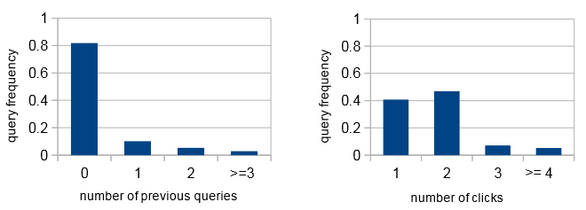

Query Suggestion(2) —— Learning High-Order Relation in Query Logs
====================================================================
.. sectionauthor:: Superjom <yanchunwei {AT} outlook.com>

*2014-08-16*

上面一篇文章讲到的VMM模型相对比较简单，只需要统计就能搭建整个模型。

本文讲的模型就相对"高端"一点，这次需要迭代去学习参数了。

high-order 模型思想
-----------------------
这个模型中会加入用户的点击(click)信息。

原因基于如下统计：

从上图可以得到的结论是： **多于一半的session中包含一次到两次的click**

因此，click信息是一个比较充裕的信息。 

此外，论文里面认为，click信息比query信息更加能够体现用户的意图。

上一篇博文里面有讲到用户的搜索行为建模，用户内心的意图，通过大脑语言的加工，
转化为SE可识别的query。 所以，可以认为query是用户意图的间接表现。

但是，当SE返回结果，用户的click操作，可以认为是内心意图的一个直接映射，这个过程对内心意图的表达是非常直接的。

比如这个搜索的行为示例

1. 用户想要去百度大厦
2. 在SE中，输入 "百度大厦"
3. 得到一系列的结果列表，里面有:

   a) 百度大厦介绍
   b) 百度大厦图片
   c) 百度大厦地址

4. 用户点击了c)结果

从上面的例子，可以很轻易的证实click信息对感知用户搜索意图的重要性。

建模
******

模型设定
+++++++++
* 如果 :math:`q_t` 紧接着 :math:`q_t`

    * :math:`q_r` 是 refer query
    * :math:`q_t` 是 target query(预测目标)

* 如果中间包含一次点击，称 :math:`\langle q_r, u, q_t \rangle` 为一个RUT元组.

包含隐含变量的用户搜索行为建模
+++++++++++++++++++++++++++++++++
较之VMM，本文中的模型会对用户内心中的意图作为隐含状态进行建模。

具体过程如下：

1. 用户有一个意图(intent/state) :math:`\bbox[yellow]{i}` ，概率是 :math:`P(i)`
2. 产生一个query :math:`q_r` ，概率是 :math:`P(q_r|i)`
3. 在结果页面点击了一个URL :math:`u` ，概率是 :math:`P(u|i)`
4. 未满足，基于之前的搜索意图，产生了另外一个意图 :math:`\bbox[yellow]{j}` ，概率是 :math:`P(j|i)` .
5. 产生query :math:`q_t` ，概率是 :math:`P(q_t|j)`

一个完整RUT的概率计算如下：

.. math::

    P(q_r, u, q_t) = \sum_{i,j} P(q_r|i) P(u|i) P(i,j) P(q_t|j)

那么，对于所有训练数据的RUT组的似然估计如下

.. math::

    l = \prod_{q_r, u, q_t} 
        \left[
            \sum_{i,j} P(q_r|i) P(u|i) P(i,j) P(q_t|j) 
        \right]^{\bbox[yellow]{n(q_r, u,q_t)}}

其中，参数为 :math:`\Theta = \{ P(q_r|i), P(u|i), P(i,j), P(q_t|j) \}` 

用EM进行参数学习
------------------
上面建模的过程中，将用户内心意图建模为隐含状态。
完整的建模过程跟HMM模型非常相似，包括采用EM算法学习参数。 

有类似采用HMM算法来建模搜索过程的论文，跟本文方法比较类似，详看引文中第二篇论文。

E-step
*********
.. math::

    P(\boxed{i,j} | q_r, \bbox[yellow]{u}, q_t) = \frac{P(i,j)P(q_r|i)P(u|i)P(q_t|j)}
        {\sum_{i',j'} P(i,j)P(q_r|i')P(u|i')P(q_t|j')}

M-step
********
.. math::

    \begin{split}
    \boxed{P(i,j)} & = \frac{\sum_{q_r, u, q_t} n(q_r, u, q_t)P(i,j|q_r, u, q_t)}
        {\sum_{q_r', u', q_t'} n(q_r', u', q_t') } \\
    \boxed{P(q_r|i)} & = \frac{\sum_{u,q_t, j} n(q_r,u,q_t)P(i,j|q_r,u,q_t)}
        {\sum_{q_r',u', q_t', j} n(q_r', u', q_t')P(i,j'| q_r',u', q_t')} \\
    \boxed{P(u|i)} &= \frac{\sum_{q_r,q_t,j} n(q_r,u,q_t)P(i,j|q_r,u,q_t)}
        {\sum_{q_r', u', q',j'} n(q_r',u',q_t')P(i,j'| q_r',u',q_t')} \\
    \boxed{P(q_t|j)} &= \frac{\sum_{q_t,u,i} n(p_r,u,p_t) P(i,j|q_r,u,q_t)}
        {\sum_{q_r', u', q_t',i'} n(q_r',u',q_t')P(i',j|q_r',u', q_t')} \\
    \end{split}

模型参数降维
----------------
注意原始RUT中，需要引入具体的url。 在SE的数据规模上，url可以认为是扩展速度巨大。

如果参数基于url，那么参数规模和学习速度都不能让人满意。

这篇论文中的创新之处是，用url指向网页的内容的类别 :math:`\vec{c}` 来代表url，从而将url几何映射到类别上。

.. math::

    u \rightarrow \vec{c} = (w_{u,c_1}, w_{u,c_2}, \cdots, w_{u,c_{\bbox[yellow]{n}}})

如此对参数实现了极大地降维。

.. math::

    \langle q_1, u, q_2 \rangle \rightarrow 
    \begin{cases}
        \langle q_1, c_1, q_2 \rangle \\
        \cdots \\
        \langle q_1, c_n, q_2\rangle
    \end{cases}

.. math::

    n(q_1, c, q_2) = n(q_1, u, q_2) \times w_{u,c}

基于降维模型的RUT概率计算(预测)
-----------------------------------

.. math::

    \begin{split}
        \bbox[purple]{P(u)} &= \frac{n(u)} {\sum_{u\in U} n(u)}  \\
        \bbox[blue]{P(c|u)} &= w_{u,c} \\
    \end{split}

    \boxed{
        P(q_t | q_r, u) = \frac{\sum_{c\in C} \bbox[magenta]{P(u|c)} P(q_r, c, q_t)}
            {\bbox[gray]{P(q_r, u)}}
    }

    P(u, c) = \bbox[blue]{P(c|u)}\bbox[purple]{P(u)} = \frac{n(u)w_{u,c}} 
                    {\sum_{u'\in U} n(u)}

    \boxed{
        \bbox[magenta]{P(u|c)} = \frac{P(u,c)} {\sum_u P(u,c)} 
        = \frac{n(u) w_{u,c}}
            {\sum_{u'\in U} n(u') w_{u,c}}
    }

最终得到概率近似公式：

.. math::

    \boxed{
    P(q_t|q_r, u) \propto g(q_t; q_r, u) = 
    \sum_{c\in C} \frac{n(u)w_{u,c}P(q_r,c,q_t)}
                {\sum_{u'\in U} n(u') w_{u', c}}
    }

具体的推荐方法和上篇博文里的VMM方法类似，首先都是准备一个推荐list，然后，将候选query跟用户的历史query拼成RCT，计算概率并排序，取前K。

References
--------------
.. [high-order] Context-Aware Query Recommendation by Learning High-Order Relation in Query Logs
.. [markov] Towards Context-Aware Search by Learning A Very Large Variable Length Hidden Markov Model from Search Logs
