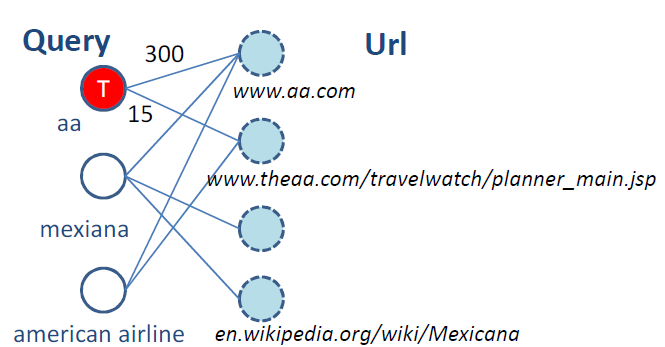

Query Suggestion(3) —— Hitting time
====================================
.. sectionauthor:: Superjom <yanchunwei {AT} outlook.com>

*2014-8-16*

这篇博文将要包含的模型是采用Random Walk(随机游走)模型来进行query prediction的。 

建模思想
---------
首先就是建立一个巨大的二部图。 其中两类节点，一类是query，另外一类是url。 

如果query和url有共现关系，就加上边，边上的权重对应着共现的概率。

左边是query，右边是url，可以建立如下的二部图：

既然要进行query的预测，那么就需要建立query-query之间的关系。 

具体的关系有如下两种：

1. :math:`Query_i \rightarrow URL_j` 

.. math::
    p_{ij} = \frac{w(i,j)}{d_i}

2. :math:`Query_i \rightarrow Query_j`

.. math::

    p_{ij} = \sum_{k\in V_2} 
    \frac{w(i,\bbox[yellow]{k})} {d_i}
    \frac{w(\bbox[yellow]{k},j)} {d_k}

可以看到，第二部是利用一个url来实现二部图中query-query的连接。

Hitting time
--------------
模型中，理解会比较麻烦的地方就是Hitting time的概念了。

首先定义集合 :math:`A` 是用户已经输入的query集合。
那么Hitting time就被定义为，在除了A之外的query集合中的query，在二部图中随机游走，最终抵达A的最短时间。

.. math::

    T^A = \min \{t: X_t \in A, t\ge 0\}

当然，这个Hitting time最终变成了步长。

:math:`i \not\in A, h_i^A = E[T_A | X_0 = i]`

.. math::

    \begin{cases}
        \begin{split}      
            h_i^A & = 0   &   \text{ for } i \in A. \\
            h_{\bbox[yellow]{i}}^A & = \sum_{\bbox[yellow]{j}\not\in A} p_{ij}h_j^A + 1  &   \text{ for } i \not\in A.
        \end{split}
    \end{cases}

一个有意思的证明如下(共同颜色的部分代表公式相同部分的推导过程)：

.. math::

    \begin{split}
        h_i^A & = \sum_{m=1}^\infty m 
            \bbox[yellow] {P[T^A=m | X_0 = i]} \\
              & = \sum_{m=1}^\infty m 
            \bbox[yellow] {\sum_{j\in V} P[X_1=j|X_0 = i].P[T^A=\boxed{m-1}|X_0 = \boxed{j}]} \\
              & = \sum_{m=1}^\infty m 
            \bbox[yellow] {
                \sum_{j\in V} p_{ij} P[T_A = m-1 | X_0 = j]
            } \\
              & = 
            \bbox[orange]{\sum_{j\in V} \sum_{m=1}^\infty
                (m-1)p_{ij} P[T^A=m-1|X_0=j] }
                + 
            \bbox[purple]{\sum_{j\in V} \sum_{m=1}^\infty
                p_{ij} P[T^A=m-1 | X_0=j] } \\
            & = \bbox[orange]{
                \sum_{j\in V} p_{ij} \sum_{m=1}^\infty m P[T^A=m-1 | X_0 = j] 
            }
            +
            \bbox[purple]{
                \sum_{j\in V} p_{ij} \sum_{m=1}^\infty P[T^A = m-1] 
            } \\
            & = \bbox[orange] {
                \sum_{j\in V} p_{ij} h_j^A 
            } 
            + 
            \bbox[purple] {
                 \sum_{j\in V} p_{ij}
            } \\
            & = \bbox[orange] {
                \sum_{j\in V} p_{ij} h_j^A
            }
            + 
            \bbox[purple] {
                1
            }
    \end{split}

最终算法
------------

INPUT
******
    
* :math:`G = (V_1 \cup V_2, E)`
* :math:`w(i,j) = C(Q_i, U_j)`
* :math:`edge_{ik}: query_i \rightarrow URL_k`

1. 给定$V_1$中query $s$，在$G$中用深度优先得到一个子图
2. 在子图中进行随机游走，路径权重用概率表示
3. 对所有的query，迭代更新

.. math::

    \begin{split}
        h_i(0) & = 0 \\
        h_i(t+1) & = \sum_{j\neq s} p_{ij} h_j(t)+1 
    \end{split}

4. 取出 top k小 :math:`h_i^*` 的query作为推荐

References
-----------
.. [hitting-time] Query Suggestion Using Hitting Time

