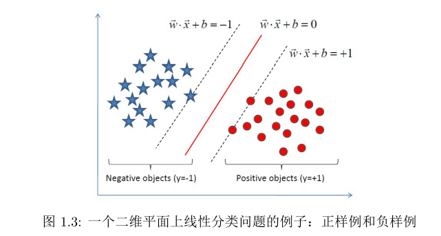
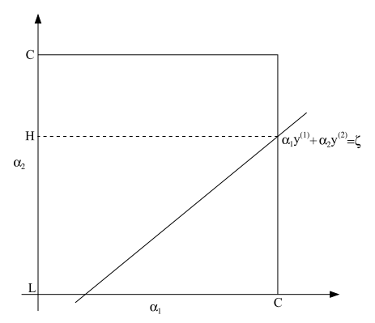

====================================
Support Vector Machines (SVM)
====================================

Introduction
-------------

**支持向量** 处在支撑平面上，将两类类别划分开来的超平面的向量点。

SVM通过寻求 **结构风险最小** 来提高学习机的泛化能力。

线性分类
----------

一个切分空间的超平面方程：

.. math::

    w^Tx + b = 0

围绕这个超平面，构成一个函数：

.. math::

    f(x) = w^T x + b

.. math::

    \begin{cases}
        \begin{split}
            y = 1 && if && f(x) > 0 \\
            y = -1 && if && f(x) < 0
        \end{split}
    \end{cases}

如图，中间的称为间隔，为了能够更好地分隔两类数据，希望中间的间隔越大越好。

具体优化思想：

1. 确定分类函数 :math:`f(x) = w^Tx + b` ，包含两个参数 :math:`w` 和 :math:`b` 。
2. 寻找两条支撑边界中最大间隔，进而确定 :math:`w` 和 :math:`b` 。
3. 进而将寻求函数 :math:`f(x) = w^Tx + b` 的问题转化为对 :math:`w` 和 :math:`b` 的凸二次规划问题。

函数间隔和几何间隔
-----------------------

:math:`w^Tx+b` 的符号和类别 :math:`y` 是一致的，所以 :math:`y(wx+b)` 肯定是正。

函数间隔
**************
定义为：

.. math::

    \hat{\gamma} = y(W^Tx + b) = yf(x)

函数间隔的问题就是不定比例，如果 :math:`w` 和 :math:`b` 同比例变化，那么超平面 :math:`f(x)=0` 不变，但是函数间隔也会同比例变化，
这个在之后的优化步骤中会比较麻烦。

几何间隔
************

直接利用点到超平面的距离公式：

.. math::
    :label: eq:1.1

    \tilde{\gamma} = \frac{ \hat{\gamma}}{ \left\| w \right\|}

最大间隔分类器
*******************

函数间隔和几何间隔相差一个 :math:`\left\| w \right\|` 的缩放因子。
在超平面固定的情况下，函数间隔可以比例无限变化，而几何间隔是固定的，因此，应该用几何间隔来作为优化目标。

也就是：

.. math::
    :label: eq:1.5.1

    max \tilde{\gamma}

.. math::
    :label: eq:1.2

    max \frac{1}{ \left\| w \right\|}

为了提升分类效果，希望中间的几何间隔越大越好：

根据间隔的定义，中间每个点到超平面的距离均大于支撑向量:

.. math:: 

    [ y_i (W^T x_i + b) = \hat{\gamma}_i \ge \hat{\gamma}, i=1,2, \dots, n ]

前面已经提到了函数间隔 :math:`\tilde{\gamma}` 可以随意变化，
那么自然可以固定住 :math:`\tilde{\gamma} = 1` 。

根据 :eq:`eq:1.1` ，可以将目标 :eq:`eq:1.2` 转化为：

.. math::

        max \frac{1}{\left\| w \right\|} 
        s.t. y_i(w^Tx_i + b) \ge 1, i=1, 2, \dots, n

总结
*********

这一小结介绍了 **函数间隔** 和 **几何间隔** ，
其中，函数间隔可以随着 :math:`\left\|w\right\|` 等比例变化，而几何间隔是固定的。

所以最大化间隔就成了最大化几何间隔 :eq:`eq:1.5.1`

由于函数间隔的不定性，可以反过来规定支持向量的函数间隔为1，
那么根据函数间隔和几何间隔之间的关系 :eq:`eq:1.1` ，
可以将原始优化转化为关于 :math:`\left\|w\right\|` 的函数: :eq:`eq:1.2` 。

从线性可分到线性不可分
-------------------------

从原始问题到对偶问题
****************************

回忆一下之前的优化目标：

.. math::
    :label: eq:2.1.1

    \max \frac{1}{\left\|w\right\|}

可以转化为：

.. math::
    :label: eq:2.1.3

    min \frac{1}{2} \left\|w\right\|^2

Lagrange对偶
**************

函数 :math:`f(x,y)` 在条件 :math:`\varphi(x,y)=0` 下的极值

.. math::

    \begin{cases}
    \frac{\partial F}{\partial x} = \frac{\partial f}{\partial x} + \theta \frac{\partial \varphi}{\partial x} = 0, \\
    \frac{\partial F}{\partial y} = \frac{\partial f}{\partial y} + \theta \frac{\partial \varphi}{\partial y} = 0, \\
    \frac{\partial F}{\partial y} = \varphi(x,y) = 0,
    \end{cases}

满足这个条件的就是函数 :math:`f(x,y)` 在条件 :math:`\varphi(x,y)=0` 下可能的极值点。

通过讲每一个约束条件加上一个Largrange乘子，即引入Lagrange对偶变量 :math:`\alpha` ，如此就可以通过Lagrange函数将约束条件融合到目标函数中。

如此，原始的优化目标可以表示为：

.. math::
    :label: eq:2.1.5

    L(w,b,\alpha) = \frac{1}{2} \left\|w\right\| - \sum_{i=1}^n \alpha_i (y_i(w^Tx_i + b)=1)

由Largrange乘子满足的条件可以得到：

.. math::
    :label:eq:2.1.13

    \frac{\partial L}{\partial w} = 0 \Rightarrow w = \sum_{i=1}^n \alpha_i y_i x_i

.. math::
    :label: eq:2.1.14

    \frac{\partial L}{\partial b} = 0 \Rightarrow \sum_{i=1}^n \alpha_i y_i = 0

将以上两个式子 :eq:`eq:2.1.13` :eq:`eq:2.1.14` 带入到 :eq:`eq:2.1.5` 中，可以得到：

.. math::

    L(w, b, \alpha) = \sum_{i=1}^n \alpha_i - \frac{1}{2} \sum_{i,j=1}^n \alpha_i \alpha_j y_i y_j x_i^T x_j

可以看到上面的Lagrange式子里面只有一个参数 :math:`\alpha` ，
如此，原始问题就变成关于 :math:`\alpha` 的优化问题：

.. math::

    \max_\alpha \sum_{i=1}^n \alpha_i - \frac{1}{2} \sum_{i,j=1}^n \alpha_i \alpha_j y_i y_j x_i^T x_j

.. math:: 

    s.t. \alpha_i \ge 0, i=1, 2, \dots, n 

.. math::

    \sum_{i=1}^n \alpha_i y_i = 0 

SMO
******

目前的优化问题变成：

.. math::
 :label: eq:svm-1.19

    \begin{split}
    max_\alpha W(\alpha) = \sum_{i=1}^m \alpha_i - \frac{1}{2} \sum_{i,j=1}^m y^{(i)}y^{(j)} \alpha_i \alpha_j \left< x^{(i)}, x^{(j)} \right>. \\
     s.t. 0 \le \alpha_i \le C, i=1, \dots, m  \\
     \sum_{i=1}^m \alpha_i y^{(i)} = 0.
     \end{split}

利用SMO来求解关于多个 :math:`\alpha_i` 的优化问题。

首先，一次无法对多个 :math:`\alpha_i` 直接优化，这是肯定的，然后一次也不能只对一个 :math:`\alpha_i` 优化。
因为:

.. math::

    \alpha_1 y^{(1)} = - \sum_{i=2}^m \alpha_i y(i).

可以看到 :math:`\alpha_1` 已经被其他 :math:`\alpha_i` 的和定死了。

SMO的做法是每次随机抽取两个 :math:`\alpha_i` , :math:`\alpha_j` 进行优化。

假设取 :math:`\alpha_1` ，:math:`\alpha_2` 进行优化，可以得到如下式子：

.. math::

    \alpha_1 y^{(1)} + \alpha_2 y^{(2)} = - \sum_{i=3}^m \alpha_i y^{(i)}

不妨将上述式子的右边用常量 :math:`\zeta` 表示： 
:math: `\alpha_1 y^{(1)} + \alpha_2 y^{(2)} = \zeta` ，结合 :eq:`eq:svm-1.19` ，可以得到类似下图：

求目标在正方形边界内关于 :math:`\alpha_i` ，
:math:`\alpha_2` 的最值，求解方法就是：
将:math:`\alpha_1` 表示为 :math:`\alpha_2` 的式子：
:math:`\alpha_1 = (\zeta - \alpha_2 y^{(2)}) y^{(1)}` ，
带入目标函数求解出最大值下的 :math:`\alpha_2` 的值，
带入求出 :math:`\alpha_1` 的值，
更新 :math:`\alpha_1` 和 :math:`\alpha_2` 的数值。

尽管SMO算法需要更多的迭代次数，但是，每次迭代的计算量并不算大，因此还是比较合理的。

核函数
********

数据不可线性可分时，需要将数据映射到线性可分的高维数据。
那么，核函数就是完成这样的映射任务，只是用了一些技巧。

可以看到 :eq:`eq:svm-1.19` 中，有核心部分是两个元素的内积 :math:`\left< x^{(i)}, x^{(j)} \right>` 。

如果直接定义单个元素的映射 :math:`\varphi(x)` ，
那么两个元素的内积会被映射为： 

.. math::

    \varphi(
        \left< 
            x^{(i)}, x^{(j)}
            \right> ) = \left< 
        \varphi(x^{(i)}),
        \varphi(x^{(i)})
        \right >

其中的运算包含三个部分：

1. 计算 :math:`\varphi(x^{(i)})`
2. 计算 :math:`\varphi(x^{(j)})`
3. 计算 :math:`\left< \varphi(x^{(i)}), \varphi(x^{(i)}) \right >`

有的时候，:math:`\varphi(x)` 的复杂度较高，
就没必要单独进行 :math:`\varphi(x)` 操作了，
直接用公式  :math:`\left< \varphi(x^{(i)}), \varphi(x^{(i)}) \right >` 的结果形式就可以了

如此，就是将 :math:`K(x^{(i)}, x^{(j)}) = \left< x^{(i)}, x^{(j)} \right>` 映射的任务作为一个整体。
其中，:math:`K(x^{(i)}, x^{(j)})` 作为一个整体，可以直接将 :eq:`eq:svm-1.19` 中所有的 :math:`x^{(i)} x^{(j)}` 替换掉。

定义了核函数的另外一个好处是，跨过单个元素的映射，直接讨论两个元素内积的映射。
如此可以自由定义一些特殊的核函数，其中一些核函数单个元素的映射 :math:`\varphi(x)` 甚至很难写出。

比如：

.. math::

    K(x,z) = (x^Tz)^2

:math:`\varphi(x)` 的形式没必要考究，直接计算核函数 :math:`K(x,z)` 便可。
    
