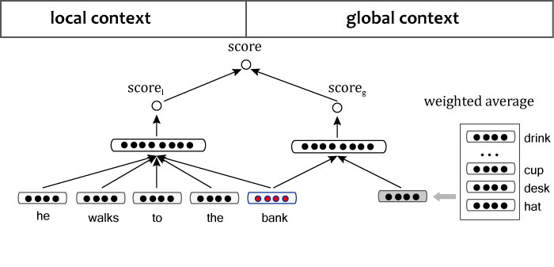

C&W的SENNA和Huang的神经语言模型
=================================
.. sectionauthor:: Superjom <yanchunwei {AT} outlook.com>

*2014-7-13*

之前做的论文是做句子的向量，基于的就是Huang [huang]_ 的模型，而Huang的模型是基于C&W [CW]_ 的模型，做个总结。

Huang的模型是在C&W模型的基础之上加了一个global context的节点，基础的定义是一致的。

C&W的SENNA
-----------
C&W做的是词向量，所以可能算不上是真正的语言模型。 C&W在文章里将这个模型称为一个框架，
事实上， 他们将词向量作为一种基本的原料，用于NLP的其他各种任务。 

与其他神经网络语言模型基于最大似然估计（概率）不同的是，C&W的模型基于打分(score)。 
形式也类似于(Pairwise Rank)，意思就是好的得分需要与差的得分的差距越大越好，可以参看 :ref:`ranknet` 。

原理
*******
语言模型的基本思想都是一致的，利用滑动窗口来处理变长的句子。

参看Fig \ref{cw-model}。 

比如，图中的窗口长度为 5，那么用前面4个词来预测最后一个词。

利用 Negative Sampling的方法，希望模型能够识别出正确的词序列和错误的词序列。

正确的词序列就是预料集中的窗口，而错误的词序列是人工抽取噪音词替换窗口最后一个词形成的。

比如图中：

* 正确的词序列： he walks to the **bank**
* 抽取了噪音词，sunny, sunday. 错误的词序列：
    1. he walks to the *sunny*
    2. he walks to the *sunday*

目标函数
***********
设定正确的词序列是 :math:`s` ， 错误的词序列是 :math:`s^w` 。
对应的得分分别是 :math:`g(s), g(s^w)` ， 其中， :math:`g(.)` 为一个采用sigmoid函数的神经网络。

.. note::

    sigmoid 函数的值域是 (0,1)

希望正确词序列的得分比错误的词序列的得分的差距越大越好，得到如下 ranking loss:

.. math::
    :label: C_s
    
    \begin{split}
    C_s & = \sum_{w\in V} \max \left( 0, 1-g(s) + g(s^w) \right) \\
        & = \sum_{w\in V} \max \left( 0, 1-(g(s) - g(s^w)) \right)
    \end{split}

要看到， :eq:`C_s` 中，需要 :math:`C_s` 越小，
就需要 :math:`g(s) - g(s^w)` 越大，也就是 :math:`g(s)` 越大同时 :math:`g(s^w)` 越小。
跟原始的目标是一致的。

神经网络结构
*************

 
上面讲到，计算得分是采用一个神经网络计算得出的，其结构如图 \ref{nn} 。

其中激活值：

.. math::

    a = f(W_1[x_1;x_2;\cdots;x_m] + b_1)

对应的得分计算：

.. math::

    score = W_2 a + b_2

Huang的神经网络语言模型
-----------------------
Huang 在 C&W模型的基础之上，加上了全局信息，同时对一词多义的情况进行了处理。

加入全局信息
***************
全局信息就是document(文档）中的全局信息，Huang认为在局部信息中意思模糊的词 ， 
在有了全局信息之后，意思能够确定下来，因此加入了document范围的信息。

所谓document的信息，就是整个文档中词的加权和（tf-idf):

.. math::

    c = \frac{ \sum_{i=1}^k w(t_i) d_i}
        {\sum_{i=1}^k w_{t_i}}

其中， :math:`w_{(.)}` 在文中就是 tfidf.

对应C&W中的 ranking loss 变成：

.. math::

    C_{s,d} = \sum_{w\in V} \max \left( 0, 1- g(s,d) + g(s^w, d) \right)

加入了global context 的得分：

.. math::
    
    a^g = f(W_1^{(g)} [c; x_m] + b_1^{(g)})

    score_g = W_2^{(g)} a_1^{(g)} + b_2^{(g)}

总得分是：

.. image::

    score = score + score_g

加入一词多义
****************
多数的神经语言模型，只能为一个词学习一个意思，对于一词多义无能为力。

Huang采用的方法就是，采用聚类(k-means)得出一个词不同的应用场合（cluster），然后将不同场合下的目标词加上不同的标记，并当成不同的词送入模型进行训练。

方法比较简单巧妙，类似的方法还有word2vec中，对短语语义的学习也是，
首先采用启发式的方法得到使用频率比较高的短语，
然后将短语用唯一标记来代替（比如，*word1-word2-word3* 的形式）。

References
----------------
.. [CW] Collobert, Ronan, and Jason Weston. "A unified architecture for natural language processing: Deep neural networks with multitask learning." Proceedings of the 25th international conference on Machine learning. ACM, 2008.
.. [huang] Huang, Eric H., et al. "Improving word representations via global context and multiple word prototypes." Proceedings of the 50th Annual Meeting of the Association for Computational Linguistics: Long Papers-Volume 1. Association for Computational Linguistics, 2012.
