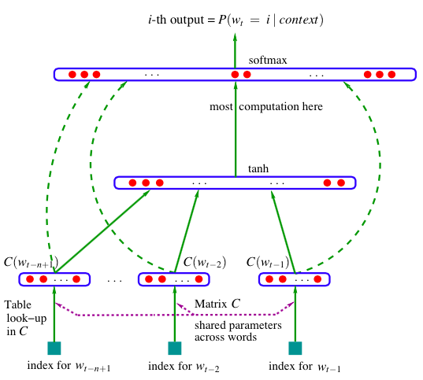

A Neural Probabilistic Language Model (Bengio 2003)
=====================================================
.. sectionauthor:: Superjom <yanchunwei {AT} outlook.com>

*2014-12-15*

这个模型算是神经网络语言模型的开山之作吧，从开始定义了神经网络在经典语言模型里的作用。

经典的N gram语言模型，采用滑动窗口的方式来计算一个N个词组合起来的联合概率。
这里的N不能太大，因为每个词在每种上文中的条件概率都需要记录，如果N很大的话，那么组合就比较多，这样需要存储的参数量也会大很多。
N所带来的问题就是纬度灾难。

这篇文章介绍的模型(NPLM)就是用神经网络来计算条件概率:

1. 为每个单词学习一个分布式的表示(a distributed representation)-- 也就是词向量
2. 用神经网络学习一个概率函数

获得的效果：

1. 用神经网络和分布式表示的固定数量的参数来解决纬度灾难
2. 很好的泛华能力，即使对训练集中没有出现过的词序列，也能预测出联合概率

统计语言模型
--------------
一个标准的统计语言模型可以表示为给定一个序列中前面的词，后面的词出现的条件概率。

.. math::

    \hat{P}(w^T_1) = \int_{t=1}^T \hat{P}(w_t | w_1^{t-1})

这里， :math:`w_t` 代表第 :math:`t` 个词。

子序列可以表示为 :math:`w_i^j = (w_i, w_{i+1}, \cdots, w_{j-1}, w_j)`

上面的模型会对整个序列就行建模，这样容易出现纬度灾难。

一种妥协的方法是，限定建模子序列的长度，这就是N-gram模型的由来。
N-gram会建模当前词与前面 :math:`N-1` 个词的条件概率。

.. math::
    
    \hat{P}(w_t | w_1^{t-1}) \approx \hat{P} (w_t | w_{t-n+1}^{t-1})

这样，在训练的时候，需要将词序列拆成N长度的子序列。
在实际应用中，N的长度有限定，而且为了进一步缩减需要记录的参数，
只对出现频度足够高的子序列进行建模。

总结出来传统模型的缺点就是:

1. N有限制，一般设为3。 如果增大N，那么子序列的频度比较小，不容易建模
2. 泛化能力有限，如果训练数据中没有出现相关组合，那么预测的时候，只能借助平滑，不能对未知的序列就行有效的预测
3. 训练出的模型只是单纯的概率统计模型，没有语义性。 

对于第一个问题，当预测一个词时，它的上文的词数只能在2个左右，通过这么少的词很难将词之间的相似度展现出来。
由于第二个和第三个问题，类似如下的推广扩展在经典的N-gram模型里面是很难做到的：
`A dog was running in a room -> A cat was running in a room`
如果人看到这个句子自然会学习到 `dog` 和 `cat` 之间有某种属性的相似，但是经典N-gram只能做表面的统计，这就限制了它的有效性。

用分布式表示解决纬度灾难
--------------------------
NPLM解决纬度灾难的方法就是，分布式表示：

1. 将词库中每个词映射到一个向量空间中的一个点，这个点的坐标是一个固定长度的向量，可以称为词的特征向量，或者 **词向量** 。 
2. 在计算词序列的联合概率时，将词序列中词对应的向量连接起来，形成的长向量作为输入特征，输入到一个概率函数模块计算概率
3. 同时学习词的特征向量以及概率函数模块的参数

词的特征向量中每个特征都可以认为是一个语义纬度。 
比如，每纬特征表示意义如下： [alive?, is_animal?, is_pet?, lovely?]。
那么小狗的向量表示就是： :math:`[1, 1, 1, 1]` ，而蟑螂小强的表示可能是 :math:`[1, 0, 0, 0]` 。当然，这里是0到1间的整型表示。
当然，在最终的模型里，向量的特征意义是神经网络自己最大化收益学习出来的，可能具体表示的语义也不会这么分散，但自学习能力就是神经网络的魅力。

概率函数（模块）被表示为，给定前面的词，得到接在后面的一个词的条件概率的乘积。
这个概率函数（模块）会包含一些参数，并且在最大化训练数据的对数似然的迭代过程中，不断调整参数。
同时，相关的词的特征向量也会在学习过程中不断更新。

以上面描述的方法来看待下面的训练数据：

* The cat is walking in the bedroom
* A dog was running in a room
* The cat is running in a room
* A dog is walking in a bedroom
* The dog was walking in the room

由于神经网络的输入特征的纬度是固定的，所以依旧需要采用滑动窗口的方式来构建固定长度的输入向量。（后面会讲到）
比如，窗口设为4，那么当算法看到如下数据:

* The *cat* is walking
* The *dog* is walking

要最大化这两个记录出现的联合概率的最大化，那么 `cat` 和 `dog` 两个词肯定会有 `is walking` 的属性，这个属性的对应关系会被词向量和概率函数的参数记忆下来。 

当然，当训练数据足够丰富，那么会有 `cat` 和 `dog` 类似 `is eating` ， `is sleeping` 的数据，那么这些数据又会告诉模型， `cat` 和 `dog` 会吃饭，会睡觉。
而这些都会记录在词向量中。 于是乎， `cat` 和 `dog` 因为在某些方面有很相似，也促使人类对它俩做了很多类似语言描述。 
基于这些描述就行学习的NPLM最终也会得到在一些方面（属性/纬度/特征）方面比较近似的词向量。

前面说了共同点的产生，下面讲下词向量差异性的由来。当我们获取了更多的数据，发现对于 `cat` ，有很多类似 `cat is eating fish` 的记录；而 `dog` 有很多类似 `dog is eating bone` 。 
前者促使 `cat` 的词向量加入吃鱼的属性；后者促使 `dog` 的词向量中加入吃骨头的属性。 
这个时候你问模型 `猫吃骨头` 对吗？ 模型把猫吃骨头的词向量作为输入，计算出来的概率很低，于是模型 *告诉* 你不太可能。
你再问 `猫吃鱼` 对吗？ 模型得到一个很高的概率，于是， *说* 应该吃。这个就是词向量差异性的由来。

因为整个模型是用来拟合训练数据的，词向量会基于上（下）文来学习和记忆对应词的属性。 
词向量会因为数据中相似词具有的相似的模式而学习到相似的属性(特征)，也会因为不同的模式，而学到不同的(属性)特征。
所以，最终的效果就是，相似词会学习到相近的词向量，不同的词会学习到不同的词向量，而词与词之间的关系也被映射到一个多维（语义）空间中的向量上。

神经模型
--------------------------
训练集是一系列的词 :math:`w_1 \cdots w_T` ，其中 :math:`w_t \in V` ， :math:`V` 是词库。

模型的目标是 

.. math::

    f(w_t, \cdots, w_{t-n+1}) = \hat{P} (w_t | w_1^{t-1})

可以将函数 :math:`f(w_t, \cdots, w_{t-n+1}) = \hat{P}(w_t | w_1^{t-1})` 分解为两部分：

1. 采用一个映射 :math:`C` 从一个元素 :math:`i` 映射到一个实数向量 :math:`C(i) \in \mathbb{R}^m` ，其中 :math:`C` 可以表示为一个 :math:`|V| \times m` 的矩阵。
2. 一个概率函数， 从一个输入的词序列的特征向量 :math:`(C(W_{t-n+1}, \cdots, C(w_{t-1}))` 映射到一个概率值

.. math::

    f(i, w_{t-1}, \cdots, w_{t-n+1}) = g(i, C(w_{t-1}), \cdots, C(w_{t-n+1}))

这两部分都有各自的参数。

具体的模型结构如下：

训练的过程就是求解参数来最大化训练集的对数似然：

.. math::

    L = \frac{1}{T} \sum_t \log f(w_t, w_{t-1}, \cdots, w_{t-n+1}; \theta) + R(\theta)

其中， :math:`R(\theta)` 是一个正则化项。 
在具体实现中，:math:`R(\theta)` 只针对神经网络的参数。

为了保证一段上文下，所有的候选的概率和为1（任何词都可能成为候选），神经网络的softmax层的计算如下：

.. math::
    :label: softmax

    \hat{P}(w_t | w_{t-1}, \cdots, w_{t-n+1}) = \frac{e^{y_{w_t}}}
    {\sum_i e^{e^{y_i}}}

这一块计算复杂度非常高，后面博客可能会讲到的层次神经网络语言，以及word2vec 都有重点优化这部分计算。

而 :math:`y` 是神经网络的激活值：

.. math::
    
    y = b + Wx + U \tanh (d+ Hx)

其中， :math:`Wx` 是图形中的输入层向输出层的直接联通， 如果不需要，可以将 :math:`W` 中所有值都设为0 。
而 :math:`U\tanh(d+Hx)` 就是经典的以tanh作为激活函数神经网络的输出计算。
:math:`b` 是全局bias。
:math:`x` 是固定长度的输入词序列特征向量：

.. math::

    x = (C(w_{t-1}), C(w_{t-2}), \cdots, C(w_{t-n+1}))

随机梯度下降计算
------------------
基于 \eqref{softmax} 来修改对数似然的形式：

.. math::

    \log \hat{P}(w_t | w_{t-1}, \cdots, w_{t-n+1})
    = y^{w_t} - \log \sum_i e^{y_i}

更新函数是：

.. math::

    \theta \leftarrow \theta + 
        \varepsilon 
        \frac{ \partial \log \hat{P}(w_t | w_{t-1}, \cdots, w_{t-n+1})}
        {\partial \theta}

其中偏导方面的计算是

.. math::

    \frac{ \partial \log \hat{P}(w_t | w_{t-1}, \cdots, w_{t-n+1})}
        {\partial \theta}
    = \frac{ \partial y^{w_t}}
        {\partial \theta}

这里化简到这个形式，只是为了说明 \eqref{softmax} 中那个恐怖的分母并不会影响到具体的梯度更新这一块。
但是，在具体计算个概率时，每次对不同的context，都需要单独计算一次softmax的分母(整个词库范围)，这个损耗是非常大的。
