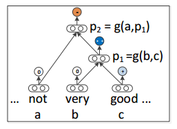

Recursive Autoencoder(RAE)
============================
.. sectionauthor:: Superjom <yanchunwei {AT} outlook.com>

*2014-7-14*

这个模型是Andrew Ng的学生Socher提出来的，刚开始在情感分析上用，效果很好。 之后也应用到了句子匹配甚至图像划分上。

模型的总体思想是，给定一个词序列(句子)，序列相邻的元素尝试合并（合并损失定义为Autoencoder去重构的误差），如此不断将合并误差小的元素两两合并，最终就有了一个类似Haffman树的结构。

树的叶子节点上是词（向量）， 中间节点就是孩子节点的两个向量合并的语义向量。

RAE主要在NLP的任务上使用，特别是有label的，比如情感分析，RAE通过重构每个元素（树中的每个节点）的label，将子节点的label合并来定义父节点label。

图 \ref{semantic-demo} 就是情感分析的例子。
其中，黄色的的节点的label是-，蓝色的节点label是+，子节点的label会合并生成父节点的label。

最初的RAE是采用贪心的方式自己构建Haffman树，复杂度非常高， 用 `sancha/jrae <https://github.com/sancha/jrae>`_ 这个代码，比较慢。

再后来发展了，构建树的过程变成了预处理，采用 Stanford Parser直接将句子解析成一个语法树（充当之前的Haffman树），之后再训练模型参数，最终还是追求重构误差最小化。

本文主要推导最初的模型，包括其中的贪心构建Haffman树的过程。

.. image:: ../_static/image/recursive-semantic.png
    :width: 600px
    :align: center
    :name: semantic-demo

组合与分解重构
---------------------------------
RAE中最基本的操作就是合并(compose)和重构(autoencode)，如图 \ref{compose} ，图中b和c合并为 :math:`p_1` ，而 :math:`p_1` 也需要重构 b, c

两个操作都是通过神经网络(NN) 来完成的。 

合并
******
:math:`\bar{c}_1, \bar{c}_2` 为两个子节点的向量，通过一个神经NN合并为父节点 :math:`\bar{p}_1`

.. math::

    \bar{p} = f \left( W^{(1)} [ \bar{c}_1; \bar{c}_2] + \bar{b}^{(1)} \right)

其中， :math:`W^{(1)}, b^{(1)}` 为合并神经NN的参数, :math:`f` 为激活函数，可以认为是 :math:`tanh` 。

重构
******
从父节点回到两个子节点：

.. math::

    [\bar{c}_1'; \bar{c}_2'] = 
        f \left( W^{(2)} \bar{p} + \bar{b}^{(2)} \right)

其中， :math:`W^{(2)} ,\bar{b}^{(2)}` 是重构神经NN的参数。
:math:`[\bar{c}_1' ; \bar{c}_2']` 就是  :math:`[ \bar{c}_1; \bar{c}_2]` 的重构。

最终的训练误差也是采用， 原始的向量与重构后的向量的重构误差来衡量。

类别分布
---------

父节点的标签分布如下：

.. math::

    \bar{d}(\bar{p}) = softmax \left( W^{(label)} \bar{p} + \bar{b}^{(label)} \right)

其中， :math:`W^{(label)} , \bar{b}^{(label)}` 是类别分布NN的参数。

损失函数    
----------
损失主要包括两部分： **语义的重构误差** :math:`E_{rec}` 和 标签的误差(预测的label与人工标注的label) :math:`E_{cE}`

.. math::

    E_{rec} \left(
        [\bar{c}_1; \bar{c}_2]_p, [\bar{c}_1'; \bar{c}_2']_p
        \right)
    = 
    \frac{n_1} {n_1 + n_2} ||\bar{c}_1 - \bar{c}_1'||^2
    + 
    \frac{n_2} {n_1 + n_2} ||\bar{c}_2 - \bar{c}_2'||^2

其中，:math:`n_1, n_2` 分别为 :math:`c_1` 和 :math:`c_2` 下的子树的节点个数。 
:math:`\frac{n_1} {n_1 + n_2}` 和 :math:`\frac{n_2} {n_1 + n_2}` 是加权和的权重，对子孙节点较多的节点的损失权重更大。

对于标签的误差，采用预测的标签与数据提供的标签之间的交叉熵来表示：

.. math::
    
    E_{cE}(\bar{p}) = - \sum_{k=1}^K t_k \log d_k(\bar{p})

其中，:math:`d_k` 和 :math:`t_k` 分别为预测和训练数据中label分布的第 :math:`k` 个元素。

生成二叉树
------------
通过贪心选择两两合并后重构损失最小的元素进行合并，最后生成整个二叉树。

.. math::

    RAE_\theta (x) = arg \min_{y \in A(x)}
            \sum_{s \in T(y)} E_{rec}( [\bar{c}_1; \bar{c}_2]_s, [\bar{c}_1'; \bar{c}_2']_s)

其中， :math:`A(x)` 是对于一个句子，所有可能的二叉树的形状集合。
:math:`T(y)` 是二叉树 :math:`y` 中所有的中间节点。

算法类似于Haffman树的构成：

.. image:: ../_static/image/recursive-algorithm-1.png
    :align: center
    :name: algorithm-1

优化目标
--------
前面介绍了学习中的两个误差： 语义误差和标签误差。 

学习的目标就是减少这两种误差：

.. math::

    \begin{split}
    J & = \frac{1}{N} 
        \sum_{x,t} E(x, t; \theta) + \frac{\lambda}{2} ||\theta||^2 \\
      & = 
        \frac{1}{N}
        \sum_{x,t} \{ \alpha E_{rec}(x;\theta) + (1-\alpha) E_{cE}(x,t;\theta)\}
            + \frac{\lambda}{2} ||\theta||^2
    \end{split}

其中， :math:`\frac{\lambda}{2} ||\theta||^2` 是正则化项， :math:`\theta` 是模型参数：

.. math::

    \theta = \left<
        W^{(1)}, \bar{b}^{(1)},
        W^{(2)}, \bar{b}^{(2)},
        W^{(label)}, \bar{b}^{(label)}, L \right>

参数的形状
*************

* 所有的词(包括中间节点)向量 :math:`\bar{c} \in \mathbb{R}^d`
* 一个词库 :math:`L \in \mathbb{R}^{d\times |V|}`
* :math:`W^{(1)} \in \mathbb{R}^{d\times 2d}`
* :math:`\bar{b}^{(1)} \in \mathbb{R}^{d}`
* :math:`W^{(2)} \in \mathbb{R}^{2d\times d}`
* :math:`\bar{b}^{(2)} \in \mathbb{R}^{2d}`
* :math:`W^{(label)} \in \mathbb{R}^{d\times K}` ， 其中 :math:`K` 是label的种类数目
* :math:`\bar{b}^{(label)} \in \mathbb{R}^{K}`

合并bias，简化表示
********************
NN中，一般会把bias合并到向量里面，简化表示：

.. math::
    :label: combine-bias

    \begin{split}
    \bar{p} & = f(\bar{a})  & = f(W^{1*} [\bar{c}_1, \bar{c}_2; 1]) \\
    [\bar{c}_1', \bar{c}_2'] & = f(\bar{e}) & = f(W^{2*}[\bar{p};1]) \\
    \bar{d} & = softmax(\bar{g}) & = softmax(W^{label*} [\bar{p};1]) 
    \end{split}

计算偏导数
**************

.. math::

    \frac{\partial J} {\partial \theta}
        = \frac{1}{N}
            \sum_{x,t}
                \frac{\partial E(x,t;\theta)}
                    {\partial \theta}
                + \lambda \theta

参考公式 :eq:`combine-bias` 中，设定如下:

.. math::
    
    \begin{split}
    \bar{a} & = W^{1*} [\bar{c}_1; \bar{c}_2; 1] \\
    \bar{e} & = W^{2*}[\bar{p};1] \\
    \bar{g} & = W^{label*} [\bar{p};1]
    \end{split}

每个参数的详细的偏导数计算如下：

.. math::

    \frac{\partial J} {\partial W^{1*}_{ij}}
    = \frac{\partial J} {\partial a_i}
        \frac{\partial a_i} {\partial W^{1*}_{ij}}
    = \delta_i \frac{\partial a_i} {\partial W^{1*}_{ij}}

    \frac{\partial J} {\partial W^{2*}_{ij}}
    = \frac{\partial J} {\partial e_i}
        \frac{\partial a_i} {\partial W^{2*}_{ij}}
    = \gamma_i \frac{\partial e_i} {\partial W^{2*}_{ij}}

    \frac{\partial J} {\partial W^{(label)}_{ij}}
    = \frac{\partial J}{\partial g_i}
        \frac{\partial g_i} {\partial W^{(label)}}
    = \zeta_i \frac{\partial g_i} {\partial W^{(label)}}

    \frac{\partial a_i} {\partial W^{1*}_i} = [\bar{c}_1; \bar{c}_2; 1]^T

    \frac{\partial e_i} {\partial W^{1*}_i} = [\bar{p}; 1]^T

    \frac{\partial g_i} {\partial W^{label*}_i} = [\bar{p}; 1]^T

下面计算 :math:`\delta_i, \gamma_i, \zeta_i` : 

:math:`\gamma_i, \zeta_i` 的计算比较直观

.. math::
    
    \begin{split}
    \gamma_i    & = \frac{\partial J} {\partial e_i} \\
                & = \alpha \frac{n_1} {n_1 + n_2} 
                    2(\bar{c}_1 - \bar{c}_1')^T
                    \left(
                        - \frac{\partial \bar{c}_1'} {\partial e_i}
                    \right)
                + \alpha \frac{n_2} {n_1 + n_2} 
                    2(\bar{c}_2 - \bar{c}_2')^T
                    \left(
                        - \frac{\partial \bar{c}_2'} {\partial e_i}
                    \right) \\ 
                & = -2 \alpha 
                    \left[
                        \frac{n_1} {n_1 + n_2} (\bar{c}_1 - \bar{c}_1');
                        \frac{n_2} {n_1 + n_2} (\bar{c}_2 - \bar{c}_2')
                    \right]^T 
                    \frac{\partial [\bar{c}_1'; \bar{c}_2']} {\partial e_i} \\
                & = -2 \alpha 
                    \left[
                        \frac{n_1} {n_1 + n_2} (\bar{c}_1 - \bar{c}_1');
                        \frac{n_2} {n_1 + n_2} (\bar{c}_2 - \bar{c}_2')
                    \right]^T 
                    f'(e_i) \\
    \zeta_i     & = \frac{\partial J} {\partial g_i} \\
                & =  (1-\alpha)
                    \frac{\partial} {\partial g_i}
                    \left(
                        - \sum_{k=1}^K t_k \log d_k
                    \right) \\
                & = (\alpha - 1) 
                    \frac{\partial } { \partial g_i}
                    \left(
                        \sum_{k \neq i}^K t_k \log d_k  + 
                         t_i \log d_i 
                    \right) \\
                & = (\alpha -1) 
                    \left(
                        \sum_{k \neq i}^K \frac{t_k}{d_k} \times \frac{\partial d_k} {\partial g_i} 
                        +  \frac{t_i \partial \log d_i} {\partial g_i}
                    \right) \\
                & = (\alpha -1)
                    \left(
                    \sum_{k \neq i}^K -t_k d_i + t_i(1-d_i)
                    \right)\\
                & = (1-\alpha) \left( 
                    d_i\sum_{k=1}^K t_k - t_i \right) \\
                & = (1-\alpha) (d_i - t_i)
    \end{split}

:math:`\delta_i` 的偏导数计算基于 :math:`\gamma_i, \zeta_z`
    
.. math::

    \begin{split}
    \delta_i & = \frac{\partial J} {\partial a_i} \\
             & = \sum_{z=1}^d \frac{\partial J} {\partial a_z}
                            \frac{\partial a_z} {\partial a_i}
                + \sum_{z=1}^{2d} \frac{\partial J} {\partial e_z}
                            \frac{\partial e_z} {\partial a_i}
                + \sum_{z=1}^{K} \frac{\partial J} {\partial g_z}
                            \frac{\partial g_z} {\partial a_i} \\
             & = \sum_{z=1}^d \delta_z
                            \frac{\partial a_z} {\partial a_i}
                + \sum_{z=1}^{2d} \gamma_z
                            \frac{\partial e_z} {\partial a_i}
                + \sum_{z=1}^{K} \zeta_z
                            \frac{\partial g_z} {\partial a_i} \\
    \end{split}

            
