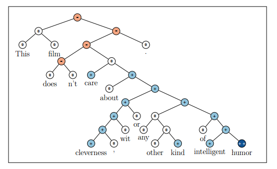

Recursive Autoencoder(RAE)
============================
.. sectionauthor:: Superjom <yanchunwei {AT} outlook.com>

*2014-7-14*

这个模型是Andrew Ng的学生Socher提出来的，刚开始在情感分析上用，效果很好。 之后也应用到了句子匹配甚至图像划分上。

模型的总体思想是，给定一个词序列(句子)，序列相邻的元素尝试合并（合并损失定义为Autoencoder去重构的误差），如此不断将合并误差小的元素两两合并，最终就有了一个类似Haffman树的结构。

树的叶子节点上是词（向量）， 中间节点就是孩子节点的两个向量合并的语义向量。

之后基于这棵树，最小化整个结构的重构误差。

RAE主要在NLP的任务上使用，特别是有label的，比如情感分析，RAE通过重构每个元素（树中的每个节点）的label，将子节点的label合并来定义父节点label。

图 `semantic-demo`_ 就是情感分析的例子。
其中，黄色的的节点的label是-，蓝色的节点label是+，子节点的label会合并生成父节点的label。

最初的RAE是采用贪心的方式自己构建Haffman树，复杂度非常高， 用 `sancha/jrae <https://github.com/sancha/jrae>`_ 这个代码，比较慢。

再后来发展了，构建树的过程变成了预处理，采用 Stanford Parser直接将句子解析成一个语法树（充当之前的Haffman树），之后再训练模型参数，最终还是追求重构误差最小化。

本文主要推导最初的模型，包括其中的贪心构建Haffman树的过程。

组合与分解重构
---------------------------------
RAE中最基本的操作就是合并(compose)和重构(autoencode)，如图 \ref{compose} ，图中b和c合并为 :math:`p_1` ，而 :math:`p_1` 也需要重构 b, c

两个操作都是通过神经网络(NN) 来完成的。 

.. image:: ../_static/image/recursive-compose.png
    :align: center
    :name: compose

合并
******
:math:`\bar{c}_1, \bar{c}_2` 为两个子节点的向量，通过一个神经NN合并为父节点 :math:`\bar{p}_1`

.. math::

    \bar{p} = f \left( W^{(1)} [ \bar{c}_1; \bar{c}_2] + \bar{b}^{(1)} \right)

其中， :math:`W^{(1)}, b^{(1)}` 为合并神经NN的参数, :math:`f` 为激活函数，可以认为是 :math:`tanh` 。

重构
******
从父节点回到两个子节点：

.. math::

    [\bar{c}_1'; \bar{c}_2'] = 
        f \left( W^{(2)} \bar{p} + \bar{b}^{(2)} \right)

其中， :math:`W^{(2)} ,\bar{b}^{(2)}` 是重构神经NN的参数。
:math:`[\bar{c}_1' ; \bar{c}_2']` 就是  :math:`[ \bar{c}_1; \bar{c}_2]` 的重构。

最终的训练误差也是采用， 原始的向量与重构后的向量的重构误差来衡量。

类别分布
---------

父节点的标签分布如下：

.. math::

    \bar{d}(\bar{p}) = softmax \left( W^{(label)} \bar{p} + \bar{b}^{(label)} \right)

其中， :math:`W^{(label)} , \bar{b}^{(label)}` 是类别分布NN的参数。

损失函数    
----------
损失主要包括两部分： **语义的重构误差** :math:`E_{rec}` 和 标签的误差(预测的label与人工标注的label) :math:`E_{cE}`

.. math::

    E_{rec} \left(
        [\bar{c}_1; \bar{c}_2]_p, [\bar{c}_1'; \bar{c}_2']_p
        \right)
    = 
    \frac{n_1} {n_1 + n_2} ||\bar{c}_1 - \bar{c}_1'||^2
    + 
    \frac{n_2} {n_1 + n_2} ||\bar{c}_2 - \bar{c}_2'||^2

其中，:math:`n_1, n_2` 分别为 :math:`c_1` 和 :math:`c_2` 下的子树的节点个数。 
:math:`\frac{n_1} {n_1 + n_2}` 和 :math:`\frac{n_2} {n_1 + n_2}` 是加权和的权重，对子孙节点较多的节点的损失权重更大。

对于标签 :math:`(-1, 0, +1)` 的误差，可以采用预测的标签与数据提供的标签之间的交叉熵表示：

.. math::
    
    E_{cE}(\bar{p}) = - \sum_{k=1}^K t_k \log d_k(\bar{p})

其中，:math:`d_k` 和 :math:`t_k` 分别为预测和训练数据中label分布的第 :math:`k` 个元素。

也可以采用平方损失：

.. math::

    E_{cE}(\bar{p}) = \frac{1}{2} ||t_k - d_k(\bar{p})||^2

此处，为了计算简便，采用平方损失。

生成二叉树
------------
通过贪心选择两两合并后重构损失最小的元素进行合并，最后生成整个二叉树。

.. math::

    RAE_\theta (x) = arg \min_{y \in A(x)}
            \sum_{s \in T(y)} E_{rec}( [\bar{c}_1; \bar{c}_2]_s, [\bar{c}_1'; \bar{c}_2']_s)

其中， :math:`A(x)` 是对于一个句子，所有可能的二叉树的形状集合。
:math:`T(y)` 是二叉树 :math:`y` 中所有的中间节点。

算法类似于Haffman树的构成：

优化目标
--------
前面介绍了学习中的两个误差： 语义误差和标签误差。 

学习的目标就是减少这两种误差：

.. math::

    \begin{split}
    J & = \frac{1}{N} 
        \sum_{x,t} E(x, t; \theta) + \frac{\lambda}{2} ||\theta||^2 \\
      & = 
        \frac{1}{N}
        \sum_{x,t} \{ \alpha E_{rec}(x;\theta) + (1-\alpha) E_{cE}(x,t;\theta)\}
            + \frac{\lambda}{2} ||\theta||^2
    \end{split}

其中， :math:`\frac{\lambda}{2} ||\theta||^2` 是正则化项， :math:`\theta` 是模型参数：

.. math::

    \theta = \left<
        W^{(1)}, \bar{b}^{(1)},
        W^{(2)}, \bar{b}^{(2)},
        W^{(label)}, \bar{b}^{(label)}, L \right>

参数的形状
*************

* 所有的词(包括中间节点)向量 :math:`\bar{c} \in \mathbb{R}^d`
* 一个词库 :math:`L \in \mathbb{R}^{d\times |V|}`
* :math:`W^{(1)} \in \mathbb{R}^{d\times 2d}`
* :math:`\bar{b}^{(1)} \in \mathbb{R}^{d}`
* :math:`W^{(2)} \in \mathbb{R}^{2d\times d}`
* :math:`\bar{b}^{(2)} \in \mathbb{R}^{2d}`
* :math:`W^{(label)} \in \mathbb{R}^{d\times K}` ， 其中 :math:`K` 是label的种类数目
* :math:`\bar{b}^{(label)} \in \mathbb{R}^{K}`

合并bias，简化表示
********************
NN中，一般会把bias合并到向量里面，简化表示：

.. math::
    :label: combine-bias

    \begin{split}
    \bar{p} & = f(\bar{a})  & = f(W^{1*} [\bar{c}_1, \bar{c}_2; 1]) \\
    [\bar{c}_1', \bar{c}_2'] & = f(\bar{e}) & = f(W^{2*}[\bar{p};1]) \\
    \bar{d} & = softmax(\bar{g}) & = softmax(W^{label*} [\bar{p};1]) 
    \end{split}

计算偏导数
**************

.. math::

    \frac{\partial J} {\partial \theta}
        = \frac{1}{N}
            \sum_{x,t}
                \frac{\partial E(x,t;\theta)}
                    {\partial \theta}
                + \lambda \theta

参考公式 :eq:`combine-bias` 中，设定如下:

.. math::
    
    \begin{split}
    \bar{a} & = W^{1*} [\bar{c}_1; \bar{c}_2; 1] \\
    \bar{e} & = W^{2*}[\bar{p};1] \\
    \bar{g} & = W^{label*} [\bar{p};1]
    \end{split}

在求导中，会涉及到父节点与左右孩子节点的梯度的传导，为了方便，将 :math:`W^{(1)}` 进行拆分成左右孩子节点对应的两部分。

.. math::

    W^{(1)} = 
    \begin{cases}
    W^{(1)}_l   &   lchild \\
    W^{(1)}_r   &   rchild \\
    \end{cases}

现在，基于当前节点 :math`s` ，其输入向量为 :math:`a_s` 

定义：  :math:`\delta_s = \partial E^{(m)} / \partial a_s`

如果，当前节点是中间节点，会有两个孩子节点：

.. math::
    \begin{split}
    \delta_{[yl]s} & = \alpha \frac{n_1}{n_1+n_2} (y_l - c_1) \\
    \delta_{[yr]s} & = \alpha \frac{n_2}{n_1+n_2} (y_r - c_2)
    \end{split}

将 :math:`softmax(x)` 简写为 :math:`\sigma(x)`  ， 关于label的误差(每个节点都会有)：

.. math::

    \delta_s = (1-\alpha) (r_s - t_s) \sigma' (a_s)

如此，基于这些 :math:`\delta_{(.)}` ， 可以计算当前节点的梯度

中间节点
++++++++++
类似神经网络的反向传导，RAE的叶子节点的梯度来自3个部分： 

1. 父亲节点的 :math:`\delta` 反向传导到当前节点的误差除去当前节点的重构 :math:`\delta`
2. 当前节点去重构子节点的重构误差(左右两个孩子)
3. 当前节点的标签预测误差

第1条看似有点奇怪，其实是当前节点对父亲节点的影响已经通过第2条进行了前向传导，因此在计算当前节点时，如果再考虑当前节点的重构误差的话，就重复了。

定义：

* :math:`p_s` 代表当前节点 :math:`s` 的父节点
* :math:`r_s` 代表当前节点的 vector
* :math:`y_l, y_r` 分别代表当前节点对其左右孩子的重构vector

对应着，各个部分：

第1部分：

父亲节点 :math:`\delta_{p_s}` 的 :math:`\delta` （可以参考  `反向传导算法, UFLDL Tutorial <http://deeplearning.stanford.edu/wiki/index.php/%E5%8F%8D%E5%90%91%E4%BC%A0%E5%AF%BC%E7%AE%97%E6%B3%95>`_  ）: :math:`\delta_{p_s}^T [W^{(1)}]_s` 

去除当前节点的重构的影响就是

.. math::

    \delta^T_{p_s} [W^{(1)}]_s - \alpha \frac{n_1}{n_1 + n_2} ( [y_r]_{p_s} - r_s)
     

第2部分：    

.. math::

    \delta^T_{[y_l]_s} W^{(2)}_l + \delta^T_{[y_r]_s} W^{(2)}_r

第3部分：

.. math::

    \sigma_s^T W^{(label)}

如此，当前节点的 :math:`\delta_s` :

.. math::
    
    \begin{split}
    \delta_s & = \frac{\partial E} {\partial a_s} \\
        & = \frac{\partial E} {\partial f(a_s)} 
            \frac{\partial f(a)} {\partial a_s} \\
        & =  f'(a_s) . \left(
        \delta^T_{p_s} [W^{(1)}]_s - \alpha \frac{n_1}{n_1 + n_2} ( [y_r]_{p_s} - r_s) +
        \delta^T_{[y_l]_s} W^{(2)}_l + \delta^T_{[y_r]_s} W^{(2)}_r +
        \sigma_s^T W^{(label)} \right)
    \end{split}

叶子节点
+++++++++
叶子节点的 :math:`\delta_s` 包含：

1. 父亲节点 :math:`\delta_{p_s}` 的传导去除当前节点的重构 :math:`\delta`
2. 当前节点的标签误差 :math:`\delta` 

对应的 :math:`\delta` 如下：

.. math::

    \delta_s = [W_{lr}]^T \delta_{p_s} - \alpha([y_l]_{p_s} - r_s) + \delta^T_s W^{(label)}

梯度计算
**********
基于上面的中间量，很容易就可以求出误差：

.. math::

    \begin{split}
    \frac{\partial E_s^{(m)}} {\partial W^{(2)}}
        & = [ \delta_{[y_l]_s}; \delta_{[y_r]_s}] [r_s;1]^T \\
    \frac{\partial E_s^{(m)}} {\partial W^{(1)}} & = \delta_s [c_l; c_r; 1]^T \\
    \frac{\partial E_s^{(m)}} {\partial W^{(label)}} & = \delta_s [r_s;1]^T \\
    \frac{\partial E_s^{(m)}} {\partial L} & = \delta_s  \\
    \end{split}

实现
-------
之前做实验，需要一个RAE生成的句子vector， 照着 jrae 写了一个 `python的版本 <https://github.com/Superjom/NeuralNetworks/blob/master/models/recursive_autoencoder/__init__.py>`_ 。

但是这个版本是不包含二叉树构建和label的，最终的产物只会包含句子vector。 

基本的工作步骤（一些依赖代码应该在周边的模块里）

* 用 Stanford parser 创建语法树
* 用word2vec 生成词的vector
* 解析语法树并构建成二叉树，并将之前的词的vector输入
* 开始RAE的训练，其中只修改中间节点的参数，保持叶子节点（词vector）不变
* 收敛之后输出句子的vector

References
------------
.. [socher-rae] Richard Socher, Alex Perelygin, Jean Wu, Jason Chuang, Christopher Manning, Andrew Ng and Christopher Potts, Recursive Deep Models for Semantic Compositionality Over a Sentiment Treebank
.. [project1] CSE 250B Assignment 4 Report, Yuncong Chen, Pengfei Chen, Yang Liu , March 24, 2012
.. [project2] CSE 250B Proceedings Assignment 4, Hani Altwaijry, Kuen-Han Liu, Toshiro Yamada

`sancha/jrae <https://github.com/sancha/jrae>`_

`反向传导算法, UFLDL Tutorial <http://deeplearning.stanford.edu/wiki/index.php/%E5%8F%8D%E5%90%91%E4%BC%A0%E5%AF%BC%E7%AE%97%E6%B3%95>`_
