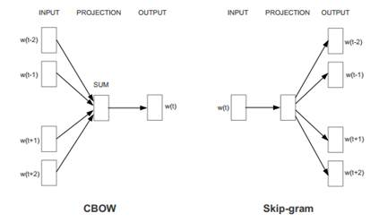

word2vec 代码实现(2) -- CBOW
===================================
看了一下gensim的代码，python非常简明易懂。

下面将一些核心的算法记录一下。

.. note::

    python代码只为表示算法原理，与源代码有一些差别，不能直接运行。

在 `word2vec 代码实现(2) -- Skip gram` 中分析了gensim 中 Skip gram 的代码。

下面来分析Cbow部分的代码。

Cbow的原理是，用周围的词组成的context来预测target word的共现度。

取得context的词向量的加和
--------------------------

.. code-block:: python
    :linenos:

    for pos, word in enumerate(sentence):

        reduced_window = random.randint(model.window) 
        start = max(0, pos - model.window + reduced_window)
        window_pos = enumerate(
                sentence[start : 
                    pos + model.window + 1 - reduced_window], start)
        word2_indices = [word2.index 
                for pos2, word2 in window_pos 
                    if (word2 is not None and pos2 != pos)]
        # l1 是 context 中所有词的词向量的和
        l1 = np_sum(model.syn0[word2_indices], axis=0) # 1 x layer1_size
        # 取mean
        if word2_indices and model.cbow_mean:
            l1 /= len(word2_indices)
        neu1e = zeros(l1.shape)

Hierarchy tree
----------------
Hierarchy tree 具体的结构和原理请参看 word2vec 的前两部分。

在上一章节讲到，Hierarchy tree 和 Negative sampling 方法的共通之处，就是有单独的 Hidden layer matrix ， 
当要用word2去预测word1时， 
就利用sigmoid函数，将word2的词向量，word1的hidden vector(s)的乘积归一成概率。

在 Negative sampling 中，每个词对应一个 hidden vector。 
在 Hierarchy tree 中， 每个词对应一个Haffman 树里的路径， 
此路径会对应到一系列的hidden vectors。 

在 Cbow 方法里， 不再是用单独的 word2 来预测 word1，而是context中的多个words 来预测。

对应的word1词向量也换成 words(in context) 的词向量的平均值。
而word2的hidden vector 不变。

.. code-block:: python
    :linenos:

    l2a = model.syn1[word.point] 
    fa = 1. / (1. + exp(-dot(l1, l2a.T))) 
    ga = (1. - word.code - fa) * alpha 
    model.syn1[word.point] += outer(ga, l1) 
    neu1e += dot(ga, l2a) 

    l2b = model.syn1neg[word_indices] 
    fb = 1. / (1. + exp(-dot(l1, l2b.T))) 
    gb = (labels - fb) * alpha 
    model.syn1neg[word_indices] += outer(gb, l1)
    neu1e += dot(gb, l2b) 

    model.syn0[word2_indices] += neu1e 

计算等参看上一章节，基本相同。

Negative sampling
---------------------
.. code-block:: python
    :linenos:

    # 正例
    word_indices = [word.index]
    # 负例
    while len(word_indices) < model.negative + 1:
        w = model.table[random.randint(model.table.shape[0])]
        if w != word.index:
            word_indices.append(w)
    # 取得样本的hidden vector
    l2b = model.syn1neg[word_indices] 
    # 最终也是，context的词向量averate，来识别样本中正例和负例
    fb = 1. / (1. + exp(-dot(l1, l2b.T))) 
    gb = (labels - fb) * alpha 
    model.syn1neg[word_indices] += outer(gb, l1) 
    neu1e += dot(gb, l2b) 
    model.syn0[word2_indices] += neu1e 

