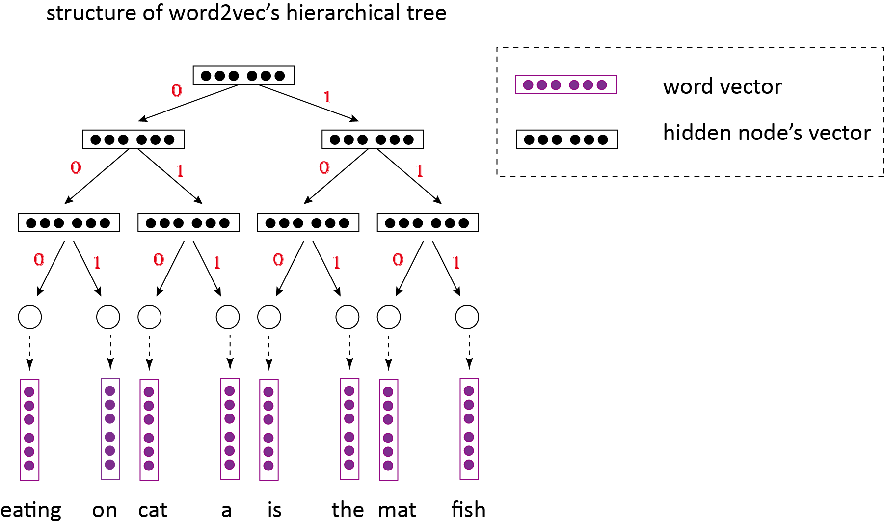

=========
word2vec  
=========

原理
-----

word2vec这一类 Neural Network Language Model (NNLM) 的都是用模型来预测词与词之间的 **共现性** 。

具体一点的实现一般都是利用上下文(context)以及目标词(target word)来实现一种 n-gram 的条件概率的效果。

一个简单的模型例子 
*******************
`` \label {subsection-a-simple-model} 

Context 一般采用固定长度的移动窗口来实现，
给定一个词序列： :math:`w_1, w_2, \cdots, w_n` ，
其中 :math:`n` 是窗口的长度， 
前 :math:`n-1` 个 word 作为 context， 
最后一个词 :math:`w_n` 作为需要预测的 target word。

在模型参数 :math:`\theta` 下最大化条件概率的预测：

.. math::
    :label: eq-common-target

    arg\max_{\theta} p(w_n | \{w_1, \cdots, w_{n-1}\})

其中

.. math::
    :label: eq-conditional-prob

    p(w_n | \{w_1, \cdots, w_{n-1}\}) =
    \frac{p(w_1, w_2, \cdots, w_n)}
        { \sum_{w` \in V} p(w_1, w_2, \cdots, w_{n-1}, w`)}

在具体的模型实现中，
概率 :math:`p(.)` 是利用神经网络(NN)来实现的，

NN能够学到一个宏观的概率函数 :math:`p(.)` ，
而具体的输入需要是长度固定的向量(vector)。
如此，为每个 word 映射一个特定的 vector，
当然这些 vector 会组成一个 :math:`|V| * |v|` 的词特征矩阵 :math:`L` (Word-Embedding-Matrix),
其中 :math:`V` 是词库， :math:`|V|` 就是词库的长度， :math:`|v|` 就是 word vector 的长度了。

需要注意的是，:math:`L` 也作为模型参数 :math:`\theta` 的一部分，在模型训练中也会一并更新。
在对语料库学习完毕后，
:math:`L` 中的 word vector :math:`v_i` 会接近到词库中 word :math:`i` 的语义，
这种语义体现在相似的 word 会有相似的表示 (vector)，
而且 word 之间的关系可以用线性关系表示， 比如通用的例子： king - man = queen - woman.

上面只是 NNLM 一个常见框架的演示，word2vec 是 NNLM 一系列优化算法的工具集，具体的实现和细节的处理方法比较丰富。

word2vec 概述 
***************
\label{subsection-word2vec-introduction}

word2vec 的目标有两种：

    1. Continuous Bag-of-Word (CBOW) 用 context 来预测 word，也就是用一个词的上下文来来预测当前词 (类似上小节的例子)。
    2. Skip-Gram 用当前词来预测其 context 中的一个词（中间的间隔随机，所以叫skip吧）。

两种目标都可以写成类似 :eq:`eq-conditional-prob` 的形式。

但是 :eq:`eq-conditional-prob` 中的分母部分需要对整个词库 :math:`V` 进行扫描，复杂度大，需要优化。
NNLM 模型有很多，但要工业化应用的话，复杂度是个问题。
而 word2vec 中比较核心的部分就是这部分巧妙的优化。

优化方式也有两种：

    1. 层次树 (Hierarchical Tree)
    2. 负例采样 (Negative Sampling)

前者尝试将词库中的每个词采用一个二元编码(binary code)进行标识（不同于 word vector），
然后利用模型和 context 来预测相应词的 binary code (CBOW),
或者由相应词来预测 上下文的 binary code (skip-gram).
整个过程等价于利用序列化的二元分类来近似原始的多元分类。

而后者采用通用的采样方法，等价于利用采样的噪音词来近似整个词库进行计算。

目标和优化方法可以自由组合，因此最终会有4中训练方法， 比如 CBOW 可以用 Hierarchical Tree 的方法训练，也可以用 Negative Sampling 的方法。

Hierarchical Tree
------------------
利用层次树来优化 NNLM 非常巧妙，最早的思想在 \cite{morin2005hierarchical} 中的 Hierarchical probabilistic neural network language model（HNNLM) 便有体现，

但是 word2vec 在优化上做的更绝。

HNNLM 的树形结构
********************
HNNLM 利用一棵二叉树来组织词库，类似 图 `fig-hierarchical-tree-structure`_ 。

其中，二叉树的叶子节点对应着词库中的 word, 
而中间节点构成了神经网络的分布式隐层。

可以看到，词库中每个词都有一个类似Haffman编码的二元编码，比如 "eating" 的编码是 :math:`000` ，"the" 的编码是 :math:`101` .

二元编码就对应着到达叶子节点的路径，可以看到中间节点是共用的，比如 "eating" 和 "on" 共享了2个中间节点。

HNNLM 对这棵树的搭建要求是，语义相近的词应该共用更多的隐层，或者说隐藏节点。

所以，在二叉树的搭建时，融入了经验性的方法，比如用 WordNet 中词的相关性，或者利用聚类方法保证相似的词路径相似。

图 `fig-hierarchical-tree-structure`_ 中的词比较少，看不出相似性，如果词库中有词 drinking ，

那么 drinking 在树中应该和 eating 共用很长的路径 (中间节点）。

word2vec 的树形结构 
*********************
\label{subsection-word2vec-tree-structure}

上面有讲到，word2vec 的优化做的非常绝。

word2vec 的层次树的结构和 图 `fig-hierarchical-tree-structure`_ 一致，但是在树的构建上，
用了基于词频的haffman树，来保证词频很高的词靠近根节点，也就有更短的 bianry code，这也意味着对应着更少的 hidden code(hidden layer)，更小的神经网络计算复杂度。

从工程效率上看，这样做的好处就是，达到最高的效率；
但是如果从 HNNLM的角度看，貌似不合理。
比如词频较高的停用词 a 必然靠近根节点，
那么，"eating" 极有可能与 "a" 共用一段路径，但是两者并没有很紧密的关系。
解释不通，怎么办？

也许树结构本身并没有直接的意义，就像人的姓名，有人叫 严大毛（类似 binary code），
有人叫严小毛，但是严大毛不一定很严肃，也不一定比严小毛块头大是吧。
最最关键的是人本身，提起严大毛，他的朋友就会浮现出他的为人正直、做事认真等优点（把这些当成 word vector，或者语义），这些特性跟姓名没啥关系吧。

在word2vec 中，binary code 退化成了一种标示，但是精度影响不大，
因为模型本身会为 binary code 赋予合适的含义，而不需要人工规则的参与。

从图 `fig-hierarchical-tree-structure`_ 中可以看到，word2vec 的模型参数主要包含两部分

1. word embedding matrix :math:`L`
2. hidden node embedding matrix :math:`H = \{h_{n_k} | k=\cdots\}` ，其中 :math:`n_k` 代表一个中间节点的编号

也就是

.. math::
    :label: eq-parameter

    \theta = \{L, H\}

忽然觉得这个树结构也可以当成一棵多元分类的决策树，具体的类别就是词。 
有 context 进入，那么就把它分到 target word 这一类，如此，中间节点以及相应的表示也都是算法自己算成的。

例子：CBOW 计算
****************

Section \ref{subsection-word2vec-introduction} 中提到，

    层次树是利用序列化的二元分类来实现 :eq:`eq-conditional-prob` 。

给定一个窗口 :math:`window = \{w_1, w_2, \cdots, w_n\}` ，如 section \ref{subsection-a-simple-model} 中所述，
前 :math:`n-1` 个 word 构成 context，最后一个 word 为 target.

CBOW 尝试用 context 来预测 target word.

section \ref{subsection-word2vec-tree-structure} 中解释了 word2vec 词库的树形结构，其中有 binary code 的概念。binary code 是作为词的一个唯一标示(每个词对应独特的code），

那么这个预测过程就可以等价于：

给定 context， 预测 target word 的 binary code.

想象这样一个过程，给定 一个 :math:`n-1` 个 word 组成的 context，放到 图 `fig-hierarchical-tree-structure`_ 中树的根节点的位置，

那么我们的目标就是让这个 context 沿着 target word 的路径，

从上至下，以一定的概率 :math:`d^{(n_k)}(.)` 随机地选择向左走或者向右走，
最后能够到达 target word 对应的叶子节点的位置。 
其中，:math:`n_k` 代表树的中间节点.

那么这个选择向左走或者向右走的步骤就是二元分类，

不妨认为指定向左走，binary code = 0, 向右走 binary code = 1，

从上至下就变成了一个依次二元分类的概率乘积。

最后只会有一条路径能够成功到达target word，

选择这条路径的概率就可以作为 context 成功预测 target word 的概率。

概率计算
********
以下详细分析这个预测的过程：

上面讲到在中间节点选左选右是有一定概率的，

那么在经过中间节点 :math:`n_k` 选择向右走的概率定义为 :math:`p(b = 1 | n_k, context)` ，

结合神经网络的计算，

有

.. math::
    :label: eq-CBOW-tree-probability

    p(b=1 | n_k, context) & = p(b=1 | h_{n_k}, x) \\

    = \sigma (h_{n_k}^T x)

其中 :math:`x` 是 context 的 vector 表示:
:math:`x = [v_{w_1}, v_{w_2}, \cdots, v_{w_{n-1}}]` ，
按照 word2vec 的实现，:math:`x` 可以是各个 word vector 的求和或者连接。

:math:`b` 是对应的 binary code 位。

:math:`\sigma` 是神经网络的激活函数，可以是 tanh 或者 simoid，在word2vec 中，采用 sigmoid 函数，
下面的推论里 :math:`\sigma(x) = \frac{1}{1+e^{-x}}` 。 
:math:`h_{n_k}` 是中间节点 :math:`n_k` 对应的 vector。

那么，给定 target word 的 binary code ::math:`B=[b_1, b_2, \cdots, b_n]` ，CBOW 的完整的概率计算:

.. math::
    :label: eq-final-target

    p(w_n | context) = \prod_{k=0}^{|B|} \sigma([[b_k==1]] h_{n_k}^T x)

其中 :math:`[[(.)]]` 代表 sign函数，当条件为 :math:`True` 时，取值1， 否则为 0。

之所以会出现 eq:`eq-final-target` 中的sign函数，解释如下：

注意其中的 :math:`\sigma` 为 sigmoid函数，因此有

.. math::

    \sigma(x) = 1 - \sigma(-x)

因此

.. math::

    p(\textbf{b=1} | n_k, context) & = \sigma (h_{n_k}^T x) \\

    p(\textbf{b=0} | n_k, context) & = 1 - p(b=1 | n_k, context) \\

                                   & = \sigma (-h_{n_k}^T x) \\

由于 :math:`b \in \{0, 1\}` ，只有两种情况，直接采用 sign 函数统一形式，就变成了:eq:`eq-final-target` .

目标函数
********
上面计算得到了预测的概率，下面计算目标函数，以及相应的更新梯度。

利用最大似然估计，

现在只考虑一个window的情况，要最大化 context 预测 target word 的概率 :eq:`eq-final-target` ，

利用 :math:`-log` 的形式，整体的预测概率的似然估计是：

.. math::

    arg\max_{\theta} p(w_n | context) & = arg\max_{\theta} \prod_{k=0}^{|B|} \sigma([[b_k==1]] h_{n_k}^T x) \\

          & = arg\min_{\theta} \sum_{k=0}^{|B|} \log \sigma([[b_k==1]] h^T_{n_k} x)

如此，得到 单个window下的 cost function

.. math::
  :label: eq-cost-function

  J = \sum_{k=0}^{|B|} \log \sigma([[b_k==1]] h^T_{n_k} x)

要最大化预测概率，最小化 :math:`J` 便可。

下面根据 :eq:`eq-cost-function` :eq:`eq-parameter` 来计算梯度，细化到 context :math:`x` 和单个中间节点 :math:`n_k` 的梯度：

.. math::

    \frac{\partial J}
        {\partial x}
        = h^T_{n_k} \sigma([[b_k==0]] h^T_{n_k} x)

.. math::

    \frac{\partial J}
        {\partial h^T_{n_k}}
        = h^T_{n_k} \sigma([[b_k==0]] h^T_{n_k} x)

更新采用如下方式

.. math::
    :label: eq-update

    (.) = (.) - \lambda \frac{\partial J}{\partial (.)}

其中，:math:`\lambda` 就是学习参数了。

Skip-gram 的 Hierarchy Tree 的学习方法类似。

Negative Sampling
---------------------
负例采样的方法比较常见，最简单的实现方法是，随机抽取样本作为噪音。 
好的模型会很好地将正确的例子和噪音区分开来。

记得之前微软亚研院有出一个产品叫 **读心机器人** ，它会问你一些问题，
你只需要告诉它对错便可，最终它得出的答案十有八九是你心里所想的。
对于它提出的问题加上你的回答（标注），可以认为就是一系列正例和负例，
最终帮助它得出了真确的答案。

Negative Sampling 可以认为是用二元分类来近似多元分类。

word2vec 中对于每个 target word 会随机抽取 15-25 个 wrong word作为负例。 
只用十几个词来模拟整个词库，效率非常高。 

但是word2vec 中采用的不是简单的随机负例抽样，而是 Noise Constrastive Estimation (NCE) [NCE]_ 。
NCE 对于传统的 Negative Sampling 的不同点就是为噪音加上了一个概率 :math:`p_n(.)` ，从而使得抽样的效果更加稳定。

联合概率计算：

.. math::
    
    p(w_n, context) = \sigma(h^T x)

其中，:math:`h` 是 :math:`w_n` 对应的隐层向量，:math:`x` 是 context 的所有 word vector 求和或者连接之后的向量。
:math:`\sigma` 是 sigmoid 函数，有如下性质成立:

.. math::
    
    \sigma(x) = 1 - \sigma(-x)

很适合用来将值映射为概率使用。 

给定一个样本集 :math:`S`（包含正例和负例），假定其中的 :math:`label \in \{+1, -1\}` ，整体概率为：

.. math::
    
    p(w_n) \sim 
        p(S) = \prod_{(w, context, label) \in S} p(w, context)  

采用 :math:`-log` 转化为 Loss 函数：

.. math::
    
    L = - \sum_{(w, context, label) \in S} \log \sigma(label . h_w^T.x_w)

偏导也很简单：

.. math::

    \frac{\partial L} {\partial x_w} = \sigma(-label.h_w^T.x_w) label.h_w

    \frac{\partial L} {\partial h_w} = \sigma(-label.h_w^T.x_w) label.x_w

更新方法也类似于公式 :eq:`eq-update` .

Reference
-----------
.. [NCE] Mnih, Andriy, and Yee Whye Teh. "A fast and simple algorithm for training neural probabilistic language models." arXiv preprint arXiv:1206.6426 (2012).
