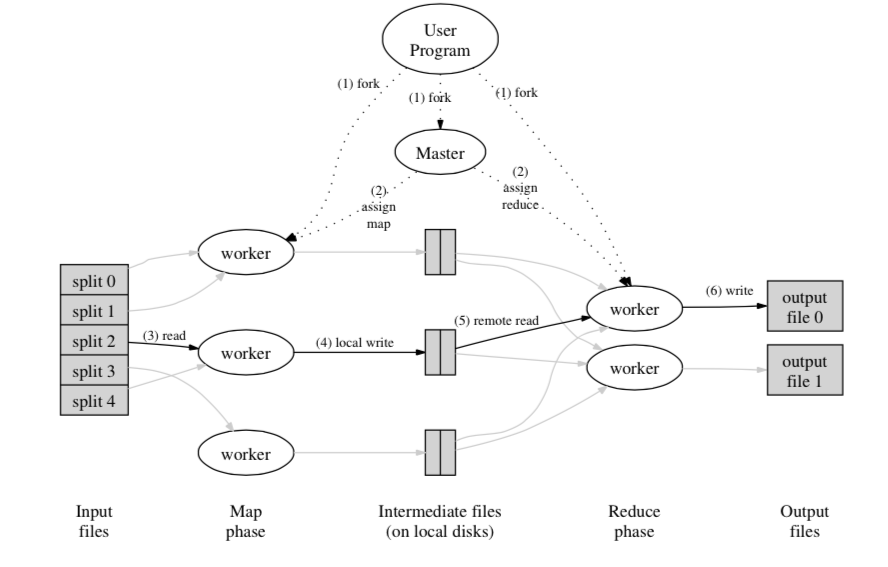

MapReduce: Simplified Data Processing on Large Clusters 笔记
==============================================================
.. sectionauthor:: Superjom <yanchunwei {AT} outlook.com>

*2014-12-25*

.. note::
    
    最近在做分布式参数服务器，从头开始把相关框架的原理看看。
    Google的MapReduce应该是当前主流的Hadoop这类应用的原点吧，看了之后，真的有一些基础的借鉴作用。
    框架本身很简洁实用，不拖泥带水，看完之后浮想联翩。

编程模型
-------------
框架内的计算就是计算 `key/value` pair集合，然后产生一个对应的输出pair集合。

基本的操作就是两个：

1. **Map** 由框架的用户自定义，处理一个输入pair，并产生一个或多个输出pair中间产物。 框架会将具有相同key的pair汇总在一块，传输给Reduce函数处理。
2. **Reduce** 也由用户定义，接收一个key，以及对应的一到多个value，使用用户定义的操作将这些value汇总起来。 最终得到一个更小的输出集合。

具体实现
---------

MapReduce 是一种编程框架，具体的实现可以根据不同的场景来设计。

比如，一个小型的共享内存的框架，或者一个大型的集群。

论文里提到的MapReduce的集群用的就是最普通的PC搭载Linux，双核，2G内存。
用这样的机器来构建集群，并处理大型任务，需要框架具有很高的容错和并发能力。

论文里提到的应用场景及对框架的要求如下：

1. 机器配置很普通，易发生故障，需要框架实现高容错性
2. 集群内联网络连接速度一般，需要尽量降低数据传输（除了任务起始和结束，Map，Reduce过程中间不需要传输数据）
3. 一个集群往往有成百上千台机器，需要框架提供非常好的并发执行能力
4. 存储是集群内部的分布式存储，考虑到单个节点的故障率，需要框架冗余存储，提供透明的可靠存储
5. 一个集群可能同时有多个用户提交的任务在执行，需要框架提供好的调度能力

执行过程
----------
**Map** 操作通过将输入数据拆分到多台机器上，并用多台机器同时处理数据，来实行分布式并行。

**Reduce** 类似地，会通过用户定义的拆分函数来将中间的key拆分到多台机器上，并行处理。

具体的执行过程如下：

1. MapReduce 先将输入文件拆分成 M块，每块的大小从16MB到64MB都可以。
之后，系统会在集群里启动多个程序的副本并行执行。
2. 其中一个程序的拷贝比较特殊— Master. 
其余的节点都称为Worker，所有Worker的任务均由Master指定。
全局会有M个map任务和R个reduce任务需要指定。 
Master会调度空闲的节点来执行Map或者Reduce任务。
3. Map任务中，程序会读取给定的输入文件，然后拆分成key/value，
并用对应的Map程序对key/value就行处理。
产生的中间key/value会在内存中缓存。
4. 内存中缓存的中间key/value会周期性地写到磁盘，
并顺便用Reduce的拆分函数拆成R份。
磁盘中的文件路径会发送给Master，Master之后会将路径转发给进行Reduce任务的Worker作为输入数据的路径。
5. 当执行Reduce的Worker知道了输入数据的路径(s)之后，
它会通过远程调用来读取自己的输入数据，
读取完毕，会根据key来就行排序，将有相同key的数据排在一起。
如果数据巨大（内存无法容纳），那么可以用外排进行排序。
6. Reduce Worker将排完序的key/value数据从前往后扫描一次，
用用户定义的Reduce函数进行处理，并将产物输出到文件中。
7. 当所有的map和reduce任务都完成了，用户程序返回。

当用户的MapReduce任务成功运行完毕，最终会输出R个输出文件。
这R个文件一般没有必要合并成一个文件（而且有可能数据巨大）。
也可以直接作为另外一轮MapReduce任务的输入。

容错
-------------------------
MapReduce一般都用来处理巨量的数据，
集群的规模也会达到成百上千的机器。 
所以，框架本事必须能够容纳机器故障。

Worker Failure
****************
Master周期性地Ping每个Worker节点。
如果在指定的时间间隔里没有回音，Master就会将此Worker标定为失效。
此Worker完成或者正在执行的任何map/reduce任务的状态都会被重置。 
Master会将此任务调度给其他Worker重新处理。

其中，失效Workder上已经完成的任务还需要重新执行，
是因为输出数据在磁盘上，失效了就无法读取。

如果失效Worker A的任务被后来调度的Worker B完成。
失效Worker A上输出文件路径如果被告知了Reduce节点，
如果Reduce Worker还没有读取A上的数据，那之后会直接告知B的输出路径，并读取B上的数据。

MapReduce框架是能够应付大规模集群故障的，因为所需要的容错操作仅仅是重启失败任务而已。   

Master Failure
*****************
Master可以定期备份自己的数据，如果其发生故障，那从最近的恢复点重新产生一个运行副本也是很容易的。

然而，如果给定只存在一个唯一的master的话，如果Master失效的话，MapReduce任务就会中断。
客户端可以重复检测Master的状态，直到Master恢复。

本地性
*********
网络带宽在实际场景中是比较限制的资源。

MapReduce压缩网络带宽的方式就是重复利用输入文件的本地性。
其中，总体的输入数据存储在GFS上，GFS可以将一个大的数据集拆成多个切片，分布式存储到多台机器上。
其中，为了容错，每个切片一般会有3份副本，存储到3台不同的机器上。

在具体分发数据的时候，MapReduce框架的Master会充分考虑数据存储的本定性，尽量将Map任务安排到靠近输入数据切片存储位置的节点上，这样，读取输入数据的最理想状态就是本地读取而不需要网络传输。

在实际应用中，本地性体现在，一个任务里的运行Map节点绝大多数都是本地读取数据，这样很大长度上节约了网络带宽。

任务粒度
*********
通常，会将Map任务拆成M份，Reduce任务拆成R份。 
理想状态，M和R都会比Worker机器多得多。 
这样，每台机器就会用多线程（进程）来完成多个任务（一个任务线程/进程就是一个worker节点），可以提升性能（IO/计算啥的）。
而且，如果一个机器失败了，那恢复的成本也会比较低：这台机器完成的多个map任务会很方便地分给另外多台机器完成。

具体的数量在实现中还是有一些限制的。
因为Master需要做 :math:`O(M+R)` 次的调度，而且需要保留 :math:`O(M*R)` 的状态（中间key/value从map->reduce的分发）。
考虑到内存占用，M*R就需要一个限制了。

实际经验，一般会选择 :math:`M` 使得每个单独的任务大概会有16MB到64MB的输入数据。
同时，压缩下 :math:`R` 的数量。

论文里说，一般会设置 :math:`M=200,000` ， :math:`R=5,000` ， 使用2000台机器。

任务备份
*********
一般，拖慢整个MapReduce任务的就是一些"落后者"：需要比正常机器多得多的事件来完成最后少量的Map或者Reduce任务。
"落后者"的出现可能有很多原因，比如磁盘问题导致读写速度极慢，或者CPU cache失效等，导致其完成任务的时间拖的非常长。
作为没有明显硬件故障的机器，可能并不会报废掉，Master会无数次调度"落后者"完成MapReduce的任务，拖累了总体的处理时间。

针对"落后者"的硬件问题，MapReduce框架提供了软件层的解决方法。
当MapReduce任务执行到尾声时（很多节点已经空闲），Master会调度一些空闲的节点来跑现在还没完成的任务（可能是"落后者"的缘故需要30倍时间完成，用正常节点跑，只需要1倍时间）。
这样可以很好地缓解"落后者"带来的严重的时间占用问题。

细节的优化  
----------
下面是一些扩展。

拆分函数
*******************
拆分函数用于将key/value对按照key映射到具体的worker节点上。
最常规的拆分函数就是Hash函数，比如 :math:`hash(key) % R` 。
这样的拆分函数能够提供比较好的负载均衡。

但有的时候，用户可能需要一些定制。 
比如，在对URL进行分发时，需要将有相同hostname的URL放到同一个分块中，
那么类似这样的拆分函数会比较有效 :math:`hash(hostname(URL))%R` 。

这个函数是可以由用户定义的。

保证顺序
************
在每个分块中，中间key/value(map的产出)以增序方式处理。

合并函数
**********
前面有讲到，Map过程中，会将中间key/value对于着Reduce节点拆成R个分块，并不断合并，这个中间会用到合并函数。

对于word-count任务，一般处理的过程是按句子，map出<word, count>，然后在Reduce阶段全局合并。

如果Map节点产生了下面的key/value:

* <hello, 1>
* <hello, 1>
* <hello, 1>
* <hello, 1>
* <hello, 1>
* <hello, 1>
* <hello, 2>

如果不加处理，直接向Reduce节点分发，带宽太大。
这个时候，如果将有相同word的记录合并起来，带宽能极大降低，比如上面的7行记录可以压缩成 `<hello, 8>` 一行。

一般来说，合并函数和Reduce函数是相同的。

合并和Reduce两个阶段的区别是，两者的产出不同。
前者是中间key/value合并，并存储到Map的本地分块中。 
而 Reduce的产出会写到最终的结果文件中。

输入和输出格式
***************
MapReduce库能够支持不同格式的输入格式。

比如，各种格式的文本。 每种格式都需要能够拆分出key/value.
用户可以方便地自定义格式和拆分key/value函数。

当然，输入输出的格式也是可以方便的自定义的，来源可以定义成数据库啥的。

Skipping Bad Records
*********************
有时候，用户的代码有一些bug，使得MapReduce无法完成。
很多时候，不应该调度完才抛出异常。

MapReduce库中使用了一个改进的机制，当一个task失败时，worker会传输一个"最后喘息"的UDP包，Master会统计此包出现的比例。
如果很多节点都失败了，那Master就会知道MapReduce任务出现问题(用户代码有问题)，并终止调度和执行，这样，剩余未执行的task也没必要等了，直接退出。

References
-----------
Dean, Jeffrey, and Sanjay Ghemawat. "MapReduce: simplified data processing on large clusters." Communications of the ACM 51.1 (2008): 107-113.

.. raw:: html

    <!-- 多说评论框 start -->
    

    <!-- 多说评论框 end -->
    <!-- 多说公共JS代码 start (一个网页只需插入一次) -->
    
    <!-- 多说公共JS代码 end -->

